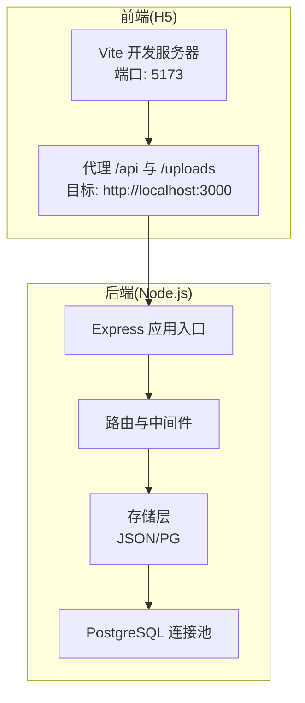
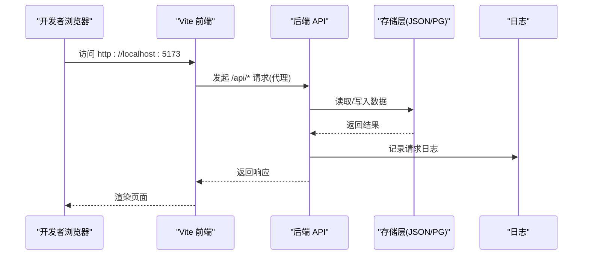
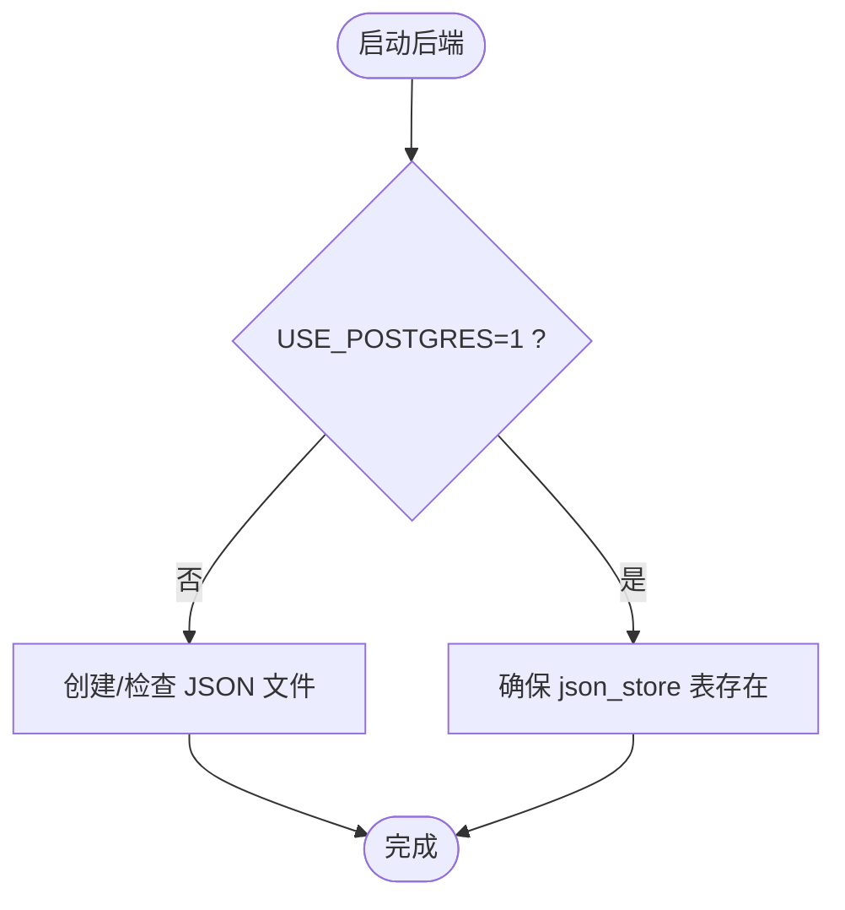
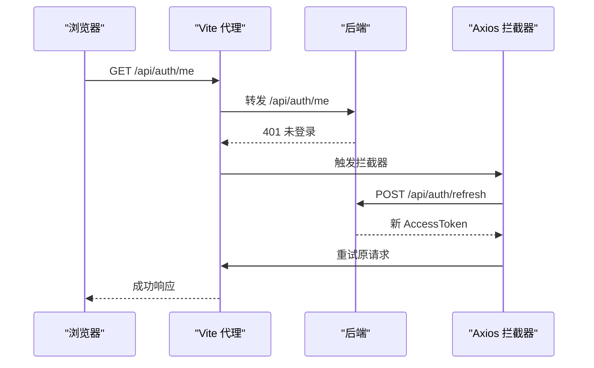
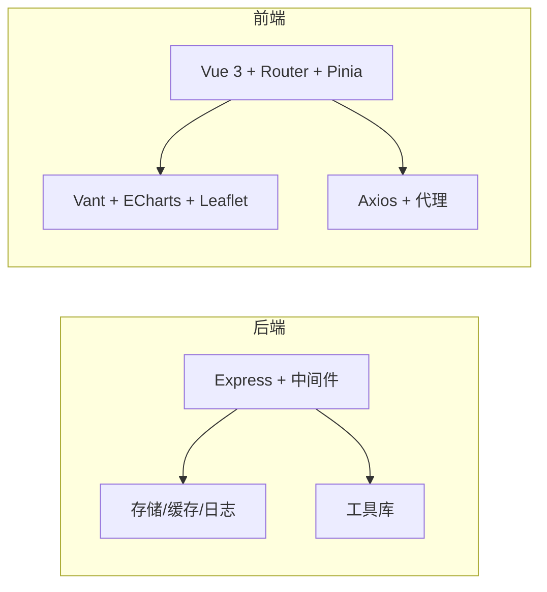

# 开发环境搭建

<cite>
**本文引用的文件**
- [backend/package.json](file://backend/package.json)
- [frontend/h5/package.json](file://frontend/h5/package.json)
- [backend/setup.sh](file://backend/setup.sh)
- [backend/setup.bat](file://backend/setup.bat)
- [backend/index.js](file://backend/index.js)
- [backend/vite.config.js](file://frontend/h5/vite.config.js)
- [backend/config.js](file://backend/config.js)
- [backend/.env.example](file://backend/.env.example)
- [backend/db/schema.sql](file://backend/db/schema.sql)
- [backend/db/migrate.js](file://backend/db/migrate.js)
- [backend/storage.js](file://backend/storage.js)
- [backend/db/pg.js](file://backend/db/pg.js)
- [frontend/h5/src/utils/http.js](file://frontend/h5/src/utils/http.js)
- [backend/logger.js](file://backend/logger.js)
- [backend/cache.js](file://backend/cache.js)
- [frontend/h5/Dockerfile](file://frontend/h5/Dockerfile)
</cite>

## 目录
1. [简介](#简介)
2. [项目结构](#项目结构)
3. [核心组件](#核心组件)
4. [架构总览](#架构总览)
5. [详细组件分析](#详细组件分析)
6. [依赖分析](#依赖分析)
7. [性能考虑](#性能考虑)
8. [故障排除指南](#故障排除指南)
9. [结论](#结论)
10. [附录](#附录)

## 简介
本指南面向低空飞行服务平台的开发者，提供从零开始搭建开发环境的完整步骤，包括环境准备、依赖安装、数据库初始化、开发调试方法、工具推荐、跨平台注意事项以及常见问题排查。目标是帮助团队快速、一致地完成本地开发环境配置，确保前后端联调顺畅。

## 项目结构
项目采用前后端分离架构：
- 后端（Node.js + Express）：提供 REST API、认证、静态资源、日志与缓存等能力
- 前端（Vue 3 + Vite）：H5 应用，通过代理访问后端 API
- 数据存储：支持 JSON 文件与 PostgreSQL 两种模式，具备迁移脚本
- 开发脚本：提供一键安装与启动脚本，覆盖 Windows 与 Linux/macOS

图表来源
- [backend/index.js:1-80](file://backend/index.js#L1-L80)
- [frontend/h5/vite.config.js:31-51](file://frontend/h5/vite.config.js#L31-L51)
- [backend/db/pg.js:1-56](file://backend/db/pg.js#L1-L56)

章节来源
- [backend/package.json:1-34](file://backend/package.json#L1-L34)
- [frontend/h5/package.json:1-27](file://frontend/h5/package.json#L1-L27)

## 核心组件
- 后端服务：基于 Express，提供认证、上传、图片压缩、请求日志、SSO、微信登录等接口
- 前端应用：基于 Vue 3 + Vite，内置代理与拦截器，自动刷新令牌
- 存储层：支持 JSON 文件与 PostgreSQL 的统一读写封装；提供缓存与迁移工具
- 配置系统：集中管理 JWT、微信、SSO、数据库、上传、服务器等配置
- 日志与缓存：结构化日志与内存缓存，便于开发调试与性能优化

章节来源
- [backend/index.js:1-120](file://backend/index.js#L1-L120)
- [frontend/h5/src/utils/http.js:1-99](file://frontend/h5/src/utils/http.js#L1-L99)
- [backend/storage.js:1-197](file://backend/storage.js#L1-L197)
- [backend/config.js:1-123](file://backend/config.js#L1-L123)
- [backend/logger.js:1-104](file://backend/logger.js#L1-L104)
- [backend/cache.js:1-119](file://backend/cache.js#L1-L119)

## 架构总览
下图展示开发阶段的典型交互：前端通过 Vite 代理访问后端，后端根据配置选择存储方式（JSON 或 PostgreSQL），并进行日志记录与缓存处理。

图表来源
- [frontend/h5/vite.config.js:35-44](file://frontend/h5/vite.config.js#L35-L44)
- [backend/index.js:116-128](file://backend/index.js#L116-L128)
- [backend/storage.js:65-132](file://backend/storage.js#L65-L132)
- [backend/logger.js:75-94](file://backend/logger.js#L75-L94)

## 详细组件分析

### 后端服务与开发脚本
- 一键安装脚本：自动检测并创建 .env、安装依赖、创建日志与上传目录
- 开发模式：使用 nodemon 自动重启，支持热更新
- 生产模式：直接启动 Node.js 应用

章节来源
- [backend/setup.sh:1-58](file://backend/setup.sh#L1-L58)
- [backend/setup.bat:1-57](file://backend/setup.bat#L1-L57)
- [backend/package.json:6-11](file://backend/package.json#L6-L11)

### 配置系统与环境变量
- 关键配置项：JWT 密钥、管理员账号、微信小程序/公众号、SSO、数据库(PostgreSQL/JSON)、上传、服务器、日志级别等
- 配置校验：对默认密钥、微信凭证、生产环境强度进行告警或强制检查
- 打印配置：启动时打印非敏感配置摘要

章节来源
- [backend/.env.example:1-104](file://backend/.env.example#L1-L104)
- [backend/config.js:7-123](file://backend/config.js#L7-L123)

### 存储层与数据库初始化
- 存储策略：USE_POSTGRES=1 时使用 PostgreSQL 的 json_store 表；否则使用 JSON 文件
- 初始化：首次启动自动创建所需 JSON 文件或确保 PostgreSQL 表存在
- 迁移：将现有 JSON 数据导入 PostgreSQL 的 json_store 表

图表来源
- [backend/storage.js:42-63](file://backend/storage.js#L42-L63)
- [backend/db/pg.js:39-48](file://backend/db/pg.js#L39-L48)
- [backend/db/schema.sql:1-10](file://backend/db/schema.sql#L1-L10)

章节来源
- [backend/storage.js:1-197](file://backend/storage.js#L1-L197)
- [backend/db/migrate.js:1-62](file://backend/db/migrate.js#L1-L62)
- [backend/db/pg.js:1-56](file://backend/db/pg.js#L1-L56)
- [backend/db/schema.sql:1-10](file://backend/db/schema.sql#L1-L10)

### 前端代理与开发调试
- 代理规则：将 /api 与 /uploads 代理到后端地址，默认 http://localhost:3000
- 开发服务器：监听 0.0.0.0，允许外网访问（如 ngrok/内网穿透）
- 安全响应头：X-Content-Type-Options、X-Frame-Options、X-XSS-Protection
- Axios 拦截器：自动携带 Bearer Token，401 时触发刷新流程

图表来源
- [frontend/h5/vite.config.js:35-44](file://frontend/h5/vite.config.js#L35-L44)
- [frontend/h5/src/utils/http.js:28-78](file://frontend/h5/src/utils/http.js#L28-L78)

章节来源
- [frontend/h5/vite.config.js:1-54](file://frontend/h5/vite.config.js#L1-L54)
- [frontend/h5/src/utils/http.js:1-99](file://frontend/h5/src/utils/http.js#L1-L99)

### 认证与会话流程
- 支持多种登录方式：账号密码、SSO、微信小程序
- 令牌机制：JWT Access/Refresh Token，刷新失败自动清除本地令牌
- 权限控制：基于角色的中间件，支持必选/可选鉴权

章节来源
- [backend/index.js:434-693](file://backend/index.js#L434-L693)
- [backend/index.js:183-231](file://backend/index.js#L183-L231)

## 依赖分析
- 后端依赖：Express、JWT、bcrypt、Multer、PostgreSQL 驱动、Sharp 图片处理、Axios、Winston 日志、XLSX 等
- 前端依赖：Vue 3、Vue Router、Pinia、Vant、Axios、ECharts、Leaflet 等
- 开发依赖：Vite、Vue 插件、基本 SSL 插件等

图表来源
- [backend/package.json:12-32](file://backend/package.json#L12-L32)
- [frontend/h5/package.json:10-25](file://frontend/h5/package.json#L10-L25)

章节来源
- [backend/package.json:1-34](file://backend/package.json#L1-L34)
- [frontend/h5/package.json:1-27](file://frontend/h5/package.json#L1-L27)

## 性能考虑
- 缓存策略：针对用户、案例、申请、服务配置等数据设置不同 TTL，降低存储层压力
- 图片压缩：Sharp 动态压缩，失败回退原图，带缓存头
- 日志分级：按级别输出，避免生产环境冗余日志
- 上传限制：最大文件大小与类型白名单，防止滥用

章节来源
- [backend/cache.js:1-119](file://backend/cache.js#L1-L119)
- [backend/index.js:86-114](file://backend/index.js#L86-L114)
- [backend/config.js:55-60](file://backend/config.js#L55-L60)
- [backend/logger.js:32-73](file://backend/logger.js#L32-L73)

## 故障排除指南
- 启动后端报错：检查 .env 是否存在且关键字段已填写；确认日志目录可写
- 前端 404/跨域：确认 Vite 代理目标与后端端口一致；检查 CORS 配置
- PostgreSQL 连接失败：确认 USE_POSTGRES=1 且连接参数正确；必要时使用 DATABASE_URL
- 上传失败：检查上传目录权限与磁盘空间；确认 ALLOWED_FILE_TYPES 与 MAX_FILE_SIZE
- 令牌失效：确认 JWT_SECRET 强度；刷新令牌流程是否正常；检查本地存储键名

章节来源
- [backend/setup.sh:9-24](file://backend/setup.sh#L9-L24)
- [backend/setup.bat:7-22](file://backend/setup.bat#L7-L22)
- [backend/config.js:78-104](file://backend/config.js#L78-L104)
- [frontend/h5/vite.config.js:35-44](file://frontend/h5/vite.config.js#L35-L44)
- [backend/db/pg.js:13-29](file://backend/db/pg.js#L13-L29)
- [backend/config.js:55-60](file://backend/config.js#L55-L60)
- [frontend/h5/src/utils/http.js:58-78](file://frontend/h5/src/utils/http.js#L58-L78)

## 结论
通过本指南，您可以快速完成低空飞行服务平台的开发环境搭建。建议优先使用 JSON 存储进行本地开发，待功能稳定后再切换至 PostgreSQL 并执行迁移。配合一键安装脚本与代理配置，前后端联调将更加高效。

## 附录

### 环境准备要求
- Node.js：建议使用长期支持版本（LTS），确保 npm 可用
- Git：用于代码拉取与版本管理
- IDE：推荐 VSCode，便于调试与插件扩展

章节来源
- [backend/package.json:1-34](file://backend/package.json#L1-L34)
- [frontend/h5/package.json:1-27](file://frontend/h5/package.json#L1-L27)

### 依赖安装步骤
- 后端依赖：进入 backend 目录，执行安装命令
- 前端依赖：进入 frontend/h5 目录，执行安装命令
- 一键安装脚本：Windows 使用 setup.bat，Linux/macOS 使用 setup.sh

章节来源
- [backend/setup.sh:26-29](file://backend/setup.sh#L26-L29)
- [backend/setup.bat:24-28](file://backend/setup.bat#L24-L28)
- [backend/package.json:12-32](file://backend/package.json#L12-L32)
- [frontend/h5/package.json:10-25](file://frontend/h5/package.json#L10-L25)

### 数据初始化流程
- 本地开发：默认使用 JSON 文件存储，首次启动自动创建
- PostgreSQL：启用 USE_POSTGRES=1，确保数据库连通；执行迁移脚本将 JSON 数据导入 json_store 表

章节来源
- [backend/storage.js:42-63](file://backend/storage.js#L42-L63)
- [backend/db/migrate.js:35-55](file://backend/db/migrate.js#L35-L55)
- [backend/db/schema.sql:1-10](file://backend/db/schema.sql#L1-L10)
- [backend/db/pg.js:39-48](file://backend/db/pg.js#L39-L48)

### 开发调试方法
- 后端热重载：使用开发脚本启动，修改代码后自动重启
- 前端热重载：Vite 默认开启，修改源码即时生效
- 断点调试：VSCode 可附加到 Node.js 进程进行断点调试
- API 测试：使用浏览器或 Postman 直接访问后端接口；前端通过代理访问

章节来源
- [backend/package.json:8-8](file://backend/package.json#L8-L8)
- [frontend/h5/vite.config.js:31-51](file://frontend/h5/vite.config.js#L31-L51)
- [backend/index.js:116-128](file://backend/index.js#L116-L128)

### 开发工具推荐
- VSCode 插件：ESLint、Prettier、Vue Language Features、REST Client、DotENV
- 调试器配置：Node 配置附加到后端进程；Chrome/Firefox 调试前端
- 代码格式化：统一使用 Prettier 与 ESLint 规则

章节来源
- [frontend/h5/package.json:21-25](file://frontend/h5/package.json#L21-L25)

### 跨平台开发注意事项
- Windows：使用 setup.bat；注意路径分隔符与换行符；确保 PowerShell 具备执行权限
- Linux/macOS：使用 setup.sh；注意可执行权限；代理与端口需与防火墙策略匹配
- 文件权限：确保 logs 与 uploads 目录可读写

章节来源
- [backend/setup.sh:1-58](file://backend/setup.sh#L1-L58)
- [backend/setup.bat:1-57](file://backend/setup.bat#L1-L57)
- [backend/storage.js:32-40](file://backend/storage.js#L32-L40)

### 一键安装脚本与环境配置模板
- 一键安装脚本：Windows 与 Linux/macOS 对应脚本，自动创建 .env、安装依赖、创建日志与上传目录
- 环境配置模板：参考 .env.example，按需填写各项配置

章节来源
- [backend/setup.sh:9-24](file://backend/setup.sh#L9-L24)
- [backend/setup.bat:7-22](file://backend/setup.bat#L7-L22)
- [backend/.env.example:1-104](file://backend/.env.example#L1-L104)

### 前端构建与部署
- 本地预览：Vite 提供本地预览命令
- 生产构建：打包产物用于 Nginx 静态托管
- Docker：可选使用 Nginx 镜像承载静态页面

章节来源
- [frontend/h5/package.json:5-9](file://frontend/h5/package.json#L5-L9)
- [frontend/h5/Dockerfile:1-22](file://frontend/h5/Dockerfile#L1-L22)