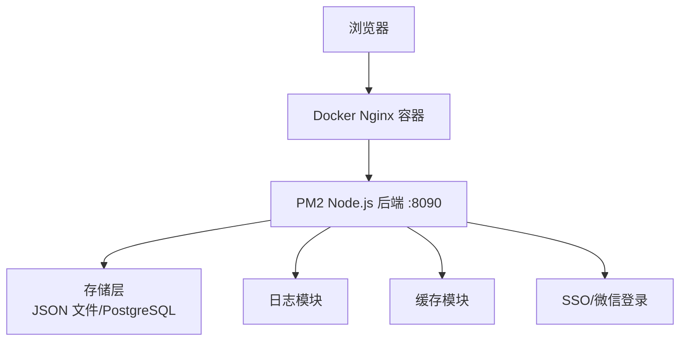
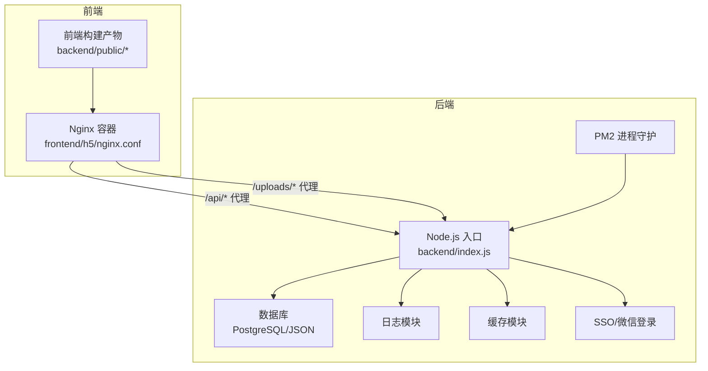
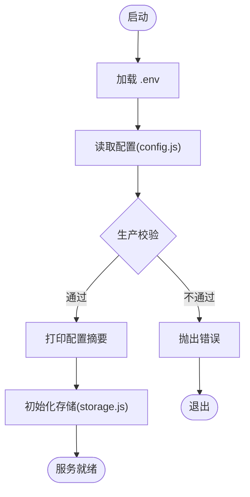
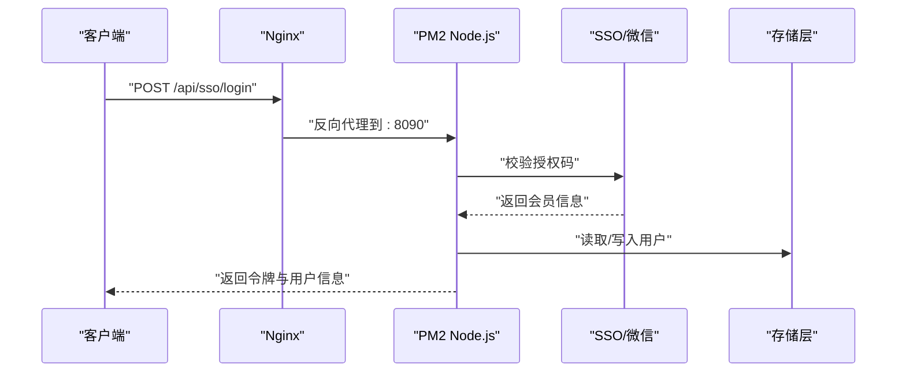
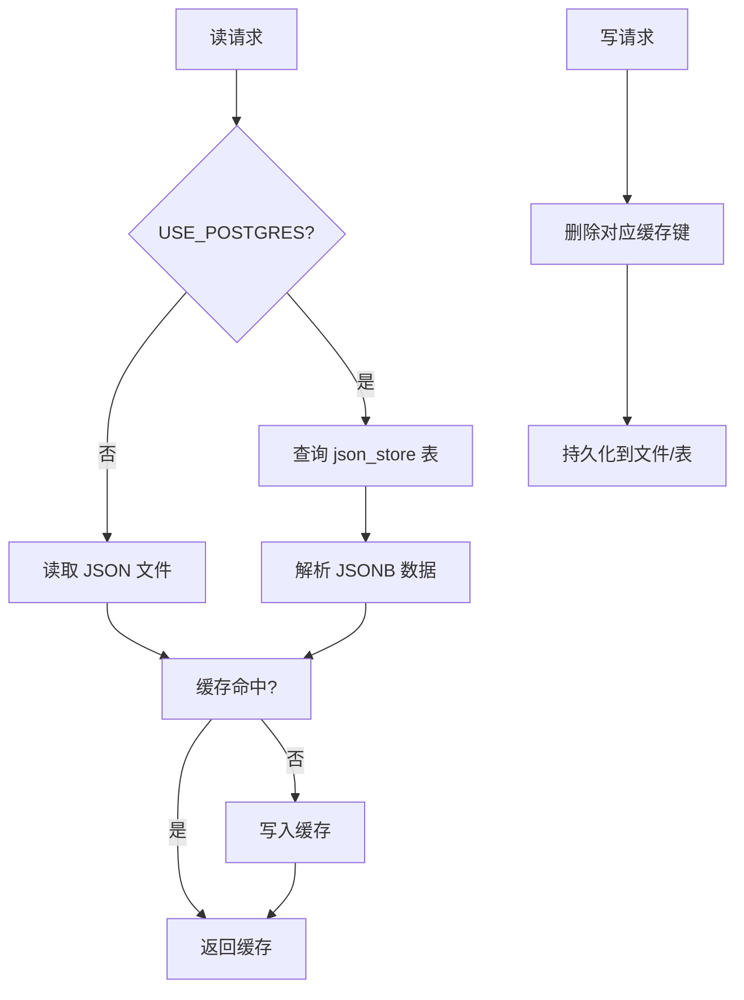
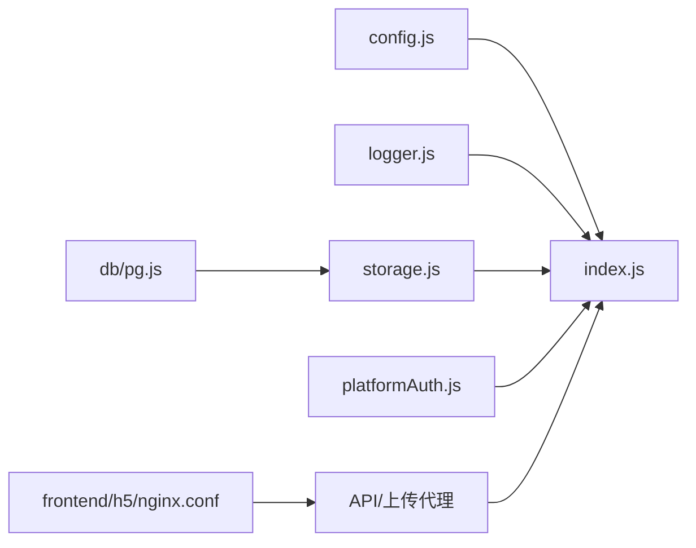

# 部署与运维

<cite>
**本文引用的文件**
- [backend/package.json](file://backend/package.json)
- [backend/config.js](file://backend/config.js)
- [backend/index.js](file://backend/index.js)
- [backend/setup.sh](file://backend/setup.sh)
- [backend/setup.bat](file://backend/setup.bat)
- [backend/db/schema.sql](file://backend/db/schema.sql)
- [backend/db/migrate.js](file://backend/db/migrate.js)
- [backend/logger.js](file://backend/logger.js)
- [backend/storage.js](file://backend/storage.js)
- [backend/platformAuth.js](file://backend/platformAuth.js)
- [backend/OPTIMIZATION_SUMMARY.md](file://backend/OPTIMIZATION_SUMMARY.md)
- [backend/QUICK_REFERENCE.md](file://backend/QUICK_REFERENCE.md)
- [backend/REFACTORING.md](file://backend/REFACTORING.md)
- [backend/部署说明.md](file://backend/部署说明.md)
- [frontend/h5/Dockerfile](file://frontend/h5/Dockerfile)
- [frontend/h5/nginx.conf](file://frontend/h5/nginx.conf)
</cite>

## 目录
1. [简介](#简介)
2. [项目结构](#项目结构)
3. [核心组件](#核心组件)
4. [架构总览](#架构总览)
5. [详细组件分析](#详细组件分析)
6. [依赖关系分析](#依赖关系分析)
7. [性能考虑](#性能考虑)
8. [故障排除指南](#故障排除指南)
9. [结论](#结论)
10. [附录](#附录)

## 简介
本文件面向低空飞行服务平台的运维与开发团队，提供从开发环境搭建到生产部署、容器化与反向代理配置、监控与日志、备份与恢复、自动化运维脚本、故障排除以及性能调优与容量规划的完整指导。文档基于仓库中的后端服务、前端构建与部署脚本、Nginx 反向代理配置、数据库迁移脚本及日志/缓存/配置模块进行整理与提炼。

## 项目结构
项目采用前后端分离架构：
- 后端 Node.js 服务通过 PM2 守护，监听 8090 端口，提供 REST API 与静态资源托管。
- 前端 Vue3 应用通过 Vite 构建，产物部署到 Nginx 容器，统一对外提供静态页面与 API 反向代理。
- 数据存储层支持 JSON 文件与 PostgreSQL（通过 JSONB 表 json_store），并内置缓存与日志模块。

**图表来源**
- [backend/部署说明.md:85-99](file://backend/部署说明.md#L85-L99)
- [frontend/h5/nginx.conf:26-41](file://frontend/h5/nginx.conf#L26-L41)
- [backend/index.js:1-200](file://backend/index.js#L1-L200)
- [backend/storage.js:1-197](file://backend/storage.js#L1-L197)
- [backend/logger.js:1-104](file://backend/logger.js#L1-L104)

**章节来源**
- [backend/部署说明.md:7-30](file://backend/部署说明.md#L7-L30)
- [frontend/h5/nginx.conf:1-87](file://frontend/h5/nginx.conf#L1-L87)
- [backend/index.js:1-200](file://backend/index.js#L1-L200)

## 核心组件
- 配置管理：集中管理 JWT、数据库、上传、服务器、微信与 SSO 等配置，并进行生产校验与打印。
- 日志模块：结构化日志，按日期落盘，支持 info/warn/error/debug 级别。
- 存储层：支持 JSON 文件与 PostgreSQL（JSONB）双模式，内置缓存与读写封装。
- 认证与权限：JWT 登录、刷新、登出；SSO 与微信登录；角色中间件与可选认证。
- SSO 对接：基于 SM2/SM4 的加解密与签名，对接畅行温州平台。
- 反向代理：Nginx 配置代理 API 与上传路径，支持 gzip 与 HTTPS。

**章节来源**
- [backend/config.js:1-123](file://backend/config.js#L1-L123)
- [backend/logger.js:1-104](file://backend/logger.js#L1-L104)
- [backend/storage.js:1-197](file://backend/storage.js#L1-L197)
- [backend/index.js:434-693](file://backend/index.js#L434-L693)
- [backend/platformAuth.js:1-177](file://backend/platformAuth.js#L1-L177)
- [frontend/h5/nginx.conf:26-85](file://frontend/h5/nginx.conf#L26-L85)

## 架构总览
整体采用“Docker Nginx + PM2 Node.js”的生产部署架构，Nginx 负责静态资源与反向代理，Node.js 提供 API 与文件上传服务，数据层可选 PostgreSQL。

**图表来源**
- [backend/部署说明.md:85-99](file://backend/部署说明.md#L85-L99)
- [frontend/h5/nginx.conf:26-85](file://frontend/h5/nginx.conf#L26-L85)
- [backend/index.js:1-200](file://backend/index.js#L1-L200)
- [backend/storage.js:1-197](file://backend/storage.js#L1-L197)
- [backend/logger.js:1-104](file://backend/logger.js#L1-L104)

## 详细组件分析

### 配置管理与环境准备
- 环境变量优先：JWT 密钥、管理员密码、数据库连接、微信与 SSO 参数均来自环境变量。
- 生产校验：生产环境要求 JWT 密钥长度≥32，否则抛出错误；同时输出配置警告。
- 快速初始化：提供 setup.sh 与 setup.bat，自动创建 .env、安装依赖、创建日志与上传目录。

**图表来源**
- [backend/config.js:78-104](file://backend/config.js#L78-L104)
- [backend/setup.sh:9-24](file://backend/setup.sh#L9-L24)
- [backend/setup.bat:7-22](file://backend/setup.bat#L7-L22)
- [backend/storage.js:42-63](file://backend/storage.js#L42-L63)

**章节来源**
- [backend/config.js:1-123](file://backend/config.js#L1-L123)
- [backend/setup.sh:1-58](file://backend/setup.sh#L1-L58)
- [backend/setup.bat:1-57](file://backend/setup.bat#L1-L57)

### 认证与权限控制
- 登录/注册：支持传统账号密码与 JWT；SSO 与微信登录；支持刷新与登出。
- 权限中间件：authRequired、roleRequired、authOptional；支持可选认证与速率限制。
- SSO/微信：对接畅行温州平台，SM2/SM4 加解密与签名；微信 code→session→用户→令牌。

**图表来源**
- [backend/index.js:493-549](file://backend/index.js#L493-L549)
- [backend/platformAuth.js:165-172](file://backend/platformAuth.js#L165-L172)
- [frontend/h5/nginx.conf:71-85](file://frontend/h5/nginx.conf#L71-L85)

**章节来源**
- [backend/index.js:434-693](file://backend/index.js#L434-L693)
- [backend/platformAuth.js:1-177](file://backend/platformAuth.js#L1-L177)

### 存储层与缓存
- 双模存储：默认 JSON 文件，启用 PostgreSQL 时使用 json_store 表；支持读写封装与缓存。
- 缓存策略：用户/申请/案例/配置分别设置不同 TTL，写入时自动清缓存。
- 迁移脚本：将 JSON 数据导入 PostgreSQL json_store 表，支持 upsert。

**图表来源**
- [backend/storage.js:65-132](file://backend/storage.js#L65-L132)
- [backend/db/schema.sql:1-10](file://backend/db/schema.sql#L1-L10)
- [backend/db/migrate.js:23-55](file://backend/db/migrate.js#L23-L55)

**章节来源**
- [backend/storage.js:1-197](file://backend/storage.js#L1-L197)
- [backend/db/schema.sql:1-10](file://backend/db/schema.sql#L1-L10)
- [backend/db/migrate.js:1-62](file://backend/db/migrate.js#L1-L62)

### 日志与监控
- 结构化日志：按日期切分文件，记录请求方法、URL、状态码、耗时与 IP。
- 错误上下文：记录错误堆栈、请求体与用户代理，便于定位问题。
- 建议：生产环境开启 HTTPS、限制 CORS、设置日志轮转与告警。

**章节来源**
- [backend/logger.js:1-104](file://backend/logger.js#L1-L104)
- [backend/OPTIMIZATION_SUMMARY.md:127-164](file://backend/OPTIMIZATION_SUMMARY.md#L127-L164)

### 反向代理与容器化
- Nginx 配置：监听 80/443，gzip 压缩，静态资源与 SPA 路由；/api 与 /uploads 代理到后端。
- Dockerfile：基于 nginx:alpine，复制 dist 与自定义 nginx.conf，暴露 80 端口。
- 生产部署：前端构建产物复制到 backend/public，Docker 容器内复制到 /usr/share/nginx/html，Nginx 重载生效。

**章节来源**
- [frontend/h5/nginx.conf:1-87](file://frontend/h5/nginx.conf#L1-L87)
- [frontend/h5/Dockerfile:1-22](file://frontend/h5/Dockerfile#L1-L22)
- [backend/部署说明.md:159-175](file://backend/部署说明.md#L159-L175)

## 依赖关系分析
- 后端依赖：Express、JWT、bcrypt、Multer、Sharp、Axios、Winston、XLSX、PostgreSQL 驱动等。
- 关键耦合：config.js 为全局配置中心；storage.js 与 db/pg 模块耦合；logger.js 与各模块松耦合。
- 外部集成：微信 API、畅行温州 SSO 平台、Nginx 容器。

**图表来源**
- [backend/package.json:12-29](file://backend/package.json#L12-L29)
- [backend/config.js:1-123](file://backend/config.js#L1-L123)
- [backend/storage.js:1-197](file://backend/storage.js#L1-L197)
- [backend/index.js:1-200](file://backend/index.js#L1-L200)
- [frontend/h5/nginx.conf:26-41](file://frontend/h5/nginx.conf#L26-L41)

**章节来源**
- [backend/package.json:1-34](file://backend/package.json#L1-L34)
- [backend/index.js:1-200](file://backend/index.js#L1-L200)

## 性能考虑
- 缓存策略：用户/申请/案例/配置分别设置不同 TTL，显著降低 I/O 与响应时间。
- 图片压缩：后端提供 /api/image 动态压缩，失败回退原图并设置缓存头。
- 前端构建：Nginx 启用 gzip，减少传输体积。
- 建议：生产环境启用 PostgreSQL、Redis 缓存、CDN 与断点续传。

**章节来源**
- [backend/storage.js:134-181](file://backend/storage.js#L134-L181)
- [backend/index.js:86-114](file://backend/index.js#L86-L114)
- [frontend/h5/nginx.conf:8-13](file://frontend/h5/nginx.conf#L8-L13)
- [backend/OPTIMIZATION_SUMMARY.md:167-195](file://backend/OPTIMIZATION_SUMMARY.md#L167-L195)

## 故障排除指南
- 启动端口占用：修改 PORT 端口后重试。
- 前端更新无效：确认已复制新构建文件到容器并重载 Nginx，强制刷新浏览器。
- git 冲突：运行时数据文件已忽略，若冲突可用 stash 或从历史恢复。
- 上传失败：检查 uploads 目录权限与磁盘空间。
- SSO 登录失败：核对平台地址、密钥与授权码。
- 服务配置页面空白：检查 services_config.json 是否为空，必要时从历史恢复并重启。

**章节来源**
- [backend/部署说明.md:316-346](file://backend/部署说明.md#L316-L346)

## 结论
本项目提供了清晰的模块化后端、完善的日志与缓存、可选的 PostgreSQL 存储、标准的 Nginx 反向代理与 PM2 守护部署方案。结合本文的配置、脚本与排障建议，可快速完成开发与生产环境的搭建与运维。

## 附录

### 开发环境搭建
- 安装依赖：在 backend 目录执行安装脚本。
- 初始化配置：复制 .env.example 为 .env，填写 JWT_SECRET、管理员密码与微信/SSO 参数。
- 启动服务：开发模式运行后端；前端在 frontend/h5 目录下安装依赖并启动开发服务器。

**章节来源**
- [backend/setup.sh:26-30](file://backend/setup.sh#L26-L30)
- [backend/setup.bat:24-28](file://backend/setup.bat#L24-L28)
- [backend/QUICK_REFERENCE.md:36-42](file://backend/QUICK_REFERENCE.md#L36-L42)

### 生产环境部署流程
- 前端构建：在 frontend/h5 执行构建并将产物复制到 backend/public。
- 服务器部署：在服务器拉取代码，安装生产依赖，PM2 启动后端服务。
- 前端上线：复制前端静态文件到 Docker 容器并重载 Nginx。
- 验证更新：检查容器内文件与后端接口返回。

**章节来源**
- [backend/部署说明.md:101-176](file://backend/部署说明.md#L101-L176)
- [backend/部署说明.md:177-247](file://backend/部署说明.md#L177-L247)

### 容器化部署方案
- Dockerfile：基于 nginx:alpine，复制 dist 与 nginx.conf，暴露 80 端口。
- Nginx 配置：监听 80/443，gzip 压缩，SPA 路由与 API/上传代理。
- 建议：生产环境启用 HTTPS 证书与 TLS 策略。

**章节来源**
- [frontend/h5/Dockerfile:1-22](file://frontend/h5/Dockerfile#L1-L22)
- [frontend/h5/nginx.conf:1-87](file://frontend/h5/nginx.conf#L1-L87)

### 负载均衡配置
- 建议：多实例后端配合 Nginx upstream 或反向代理集群，实现高可用与水平扩展。
- 注意：确保共享存储（如 PostgreSQL）与会话状态（如 Redis）满足多实例需求。

[本节为通用实践建议，不直接分析具体文件]

### 监控告警与日志管理
- 日志：按日期落盘，生产环境建议设置日志轮转与集中收集。
- 告警：结合 PM2 进程状态与错误日志，设置阈值告警。
- 建议：集成 Sentry 或同类服务，增强错误追踪与告警能力。

**章节来源**
- [backend/logger.js:1-104](file://backend/logger.js#L1-L104)
- [backend/OPTIMIZATION_SUMMARY.md:483-486](file://backend/OPTIMIZATION_SUMMARY.md#L483-L486)

### 备份与恢复策略
- 备份对象：运行时数据文件（users.json、data.json、cases.json、services_config.json）与 PostgreSQL。
- 恢复流程：停止服务，恢复文件或数据库，启动服务并验证。
- 建议：定期快照与异地备份，演练恢复流程。

**章节来源**
- [backend/部署说明.md:32-42](file://backend/部署说明.md#L32-L42)
- [backend/db/migrate.js:35-55](file://backend/db/migrate.js#L35-L55)

### 运维脚本与自动化
- 快速配置脚本：setup.sh 与 setup.bat，自动创建 .env、安装依赖、创建日志与上传目录。
- PM2 管理：启动、重启、保存进程列表与开机自启。
- 前端更新：一键复制构建产物到容器并重载 Nginx。

**章节来源**
- [backend/setup.sh:1-58](file://backend/setup.sh#L1-L58)
- [backend/setup.bat:1-57](file://backend/setup.bat#L1-L57)
- [backend/部署说明.md:249-270](file://backend/部署说明.md#L249-L270)

### 性能调优与容量规划
- 缓存：合理设置 TTL，写入时清缓存；可引入 Redis 实现分布式缓存。
- 数据库：PostgreSQL 索引优化、分页查询与连接池配置。
- 文件存储：CDN 与对象存储（如 OSS），图片压缩与断点续传。
- 容量：评估并发与峰值流量，规划 CPU/内存/磁盘与数据库连接数。

**章节来源**
- [backend/storage.js:134-181](file://backend/storage.js#L134-L181)
- [backend/OPTIMIZATION_SUMMARY.md:474-514](file://backend/OPTIMIZATION_SUMMARY.md#L474-L514)