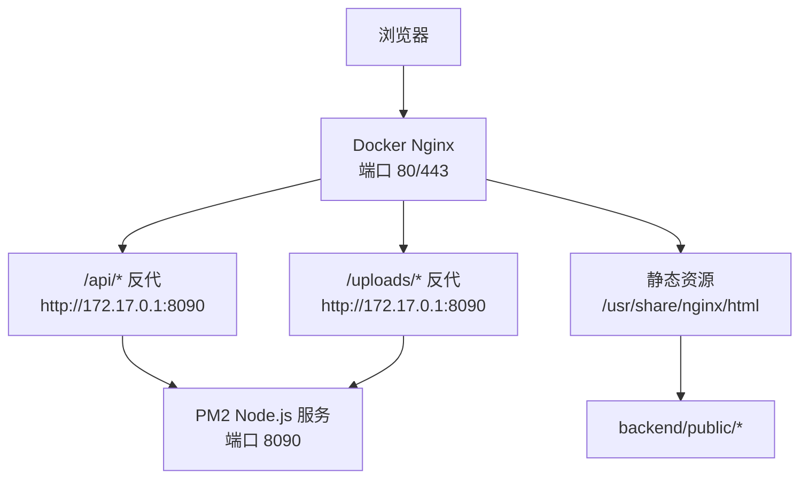
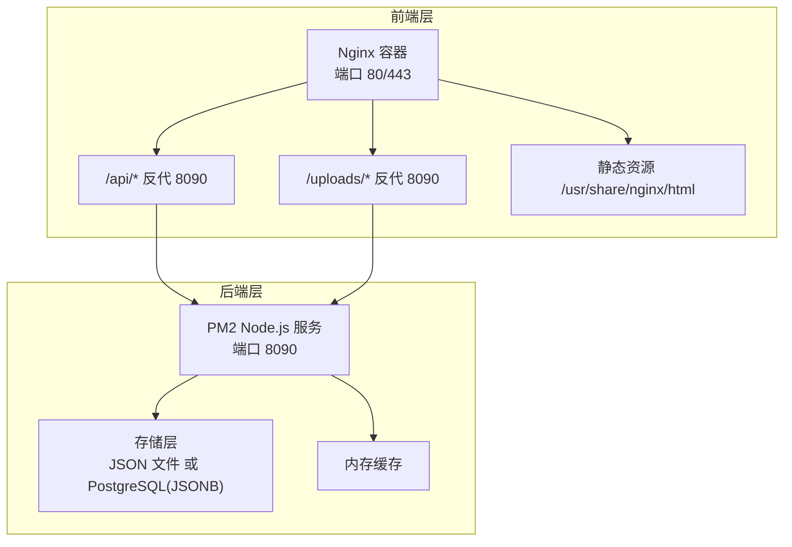
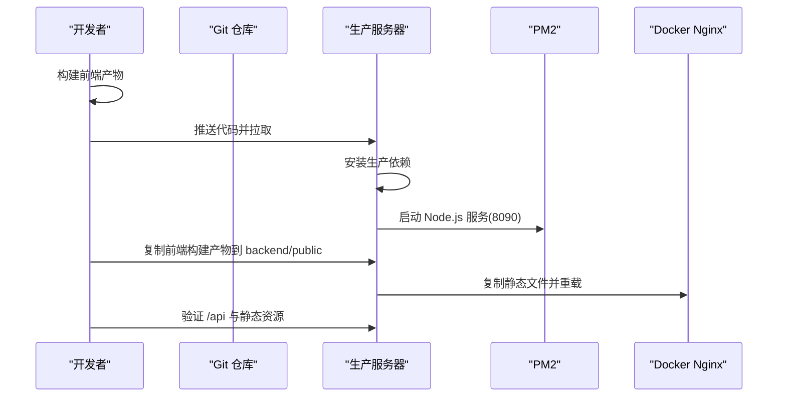
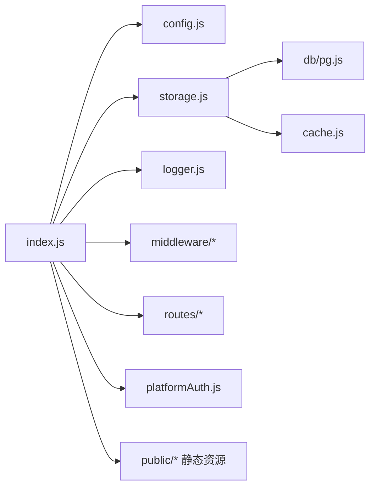

# 部署配置

<cite>
**本文引用的文件**
- [backend/package.json](file://backend/package.json)
- [backend/config.js](file://backend/config.js)
- [backend/.env.example](file://backend/.env.example)
- [backend/setup.sh](file://backend/setup.sh)
- [backend/setup.bat](file://backend/setup.bat)
- [backend/db/schema.sql](file://backend/db/schema.sql)
- [backend/db/migrate.js](file://backend/db/migrate.js)
- [backend/storage.js](file://backend/storage.js)
- [backend/cache.js](file://backend/cache.js)
- [backend/index.js](file://backend/index.js)
- [backend/部署说明.md](file://backend/部署说明.md)
- [backend/OPTIMIZATION_SUMMARY.md](file://backend/OPTIMIZATION_SUMMARY.md)
- [frontend/h5/Dockerfile](file://frontend/h5/Dockerfile)
- [frontend/h5/nginx.conf](file://frontend/h5/nginx.conf)
- [frontend/h5/vite.config.js](file://frontend/h5/vite.config.js)
</cite>

## 目录
1. [简介](#简介)
2. [项目结构](#项目结构)
3. [核心组件](#核心组件)
4. [架构总览](#架构总览)
5. [详细组件分析](#详细组件分析)
6. [依赖关系分析](#依赖关系分析)
7. [性能考量](#性能考量)
8. [故障排查指南](#故障排查指南)
9. [结论](#结论)
10. [附录](#附录)

## 简介
本文件面向低空飞行服务平台的运维与开发团队，提供一套完整的生产级部署配置指南。内容涵盖环境配置要求（Node.js版本、数据库配置、环境变量设置）、服务器配置（Nginx反向代理、SSL证书配置、静态资源处理）、数据库配置（PostgreSQL初始化、连接池配置、备份策略）、生产环境部署流程、域名配置与防火墙设置、容器化部署方案（Docker配置、镜像构建、容器编排）、负载均衡与CDN集成、部署脚本示例与配置模板、不同环境的配置差异与最佳实践。

## 项目结构
项目采用“后端(Node.js)+前端(Vue3+Vite)+容器(Nginx)”的三层架构：
- 后端：基于 Express 的 Node.js 服务，负责认证、业务逻辑、数据存储与静态资源服务。
- 前端：Vue3 + Vite 构建产物，由 Nginx 托管并反向代理 API。
- 容器：Docker 运行 Nginx，承载静态资源与反向代理；后端通过 PM2 在宿主机运行。

图表来源
- [frontend/h5/nginx.conf:1-87](file://frontend/h5/nginx.conf#L1-L87)
- [backend/部署说明.md:85-99](file://backend/部署说明.md#L85-L99)

章节来源
- [backend/部署说明.md:7-30](file://backend/部署说明.md#L7-L30)
- [frontend/h5/nginx.conf:1-87](file://frontend/h5/nginx.conf#L1-L87)

## 核心组件
- 环境变量与配置管理：集中于配置模块与 .env 示例，统一管理 JWT、数据库、微信、SSO、上传、CORS、日志等。
- 数据存储：支持 JSON 文件与 PostgreSQL（JSONB 表），具备缓存与迁移能力。
- 反向代理与静态资源：Nginx 托管前端构建产物，代理 API 与上传路径。
- 容器化：Nginx 镜像承载静态资源与反代，后端独立运行于宿主机或容器外。
- 部署流程：前后端分离构建，通过 PM2 管理后端，Docker 管理前端静态资源。

章节来源
- [backend/config.js:1-123](file://backend/config.js#L1-L123)
- [backend/.env.example:1-104](file://backend/.env.example#L1-L104)
- [backend/storage.js:1-197](file://backend/storage.js#L1-L197)
- [backend/db/schema.sql:1-10](file://backend/db/schema.sql#L1-L10)
- [frontend/h5/nginx.conf:1-87](file://frontend/h5/nginx.conf#L1-L87)
- [backend/部署说明.md:1-350](file://backend/部署说明.md#L1-L350)

## 架构总览
生产环境采用“Docker(Nginx)+PM2(Node.js)”双层架构：
- Nginx 容器负责静态资源与反向代理，监听 80/443，代理 /api 与 /uploads 到后端。
- Node.js 后端通过 PM2 运行，监听 8090，提供认证、业务与文件上传能力。
- 数据存储可选 PostgreSQL（JSONB 表），默认使用 JSON 文件存储。

图表来源
- [backend/部署说明.md:85-99](file://backend/部署说明.md#L85-L99)
- [frontend/h5/nginx.conf:26-41](file://frontend/h5/nginx.conf#L26-L41)
- [backend/storage.js:42-63](file://backend/storage.js#L42-L63)

## 详细组件分析

### 环境配置与依赖
- Node.js 版本：推荐 v16+，满足依赖与运行需求。
- 关键依赖：Express、dotenv、winston、pg、bcryptjs、jsonwebtoken、sharp、xlsx、cors、body-parser、multer 等。
- 启动脚本：开发模式与生产模式分别对应 scripts 中的 dev 与 start。

章节来源
- [backend/package.json:1-34](file://backend/package.json#L1-L34)
- [backend/部署说明.md:81-83](file://backend/部署说明.md#L81-L83)

### 环境变量与配置模板
- .env.example 提供完整配置项模板，包括服务器端口、环境、JWT 密钥、微信与公众号配置、SSO 地址与密钥、数据库选择与连接参数、上传目录与大小、CORS、日志级别与目录、SM2 密钥等。
- config.js 从环境变量读取并进行校验，生产环境强制 JWT 密钥长度≥32，打印配置信息便于核对。

章节来源
- [backend/.env.example:1-104](file://backend/.env.example#L1-L104)
- [backend/config.js:78-104](file://backend/config.js#L78-L104)

### 数据库配置与迁移
- 存储层支持两种模式：
  - JSON 文件：默认模式，启动时确保各数据文件存在。
  - PostgreSQL：启用 USE_POSTGRES=1 后，使用 JSONB 表 json_store 存储多类数据。
- 初始化与迁移：
  - schema.sql 定义 json_store 表结构（key、data(JSONB)、updated_at）。
  - migrate.js 读取 users/cases/applications/services_config 等 JSON 文件，写入 PostgreSQL 的 json_store 表。
- 连接与查询：通过 pg.js 提供 query 与表初始化方法，供 storage.js 使用。

章节来源
- [backend/storage.js:42-63](file://backend/storage.js#L42-L63)
- [backend/db/schema.sql:1-10](file://backend/db/schema.sql#L1-L10)
- [backend/db/migrate.js:35-55](file://backend/db/migrate.js#L35-L55)

### 服务器与反向代理（Nginx）
- Dockerfile：基于 nginx:alpine，复制构建产物与自定义 nginx.conf，暴露 80 端口。
- nginx.conf：
  - 80 端口：根路径与 /low-altitude/ 路由，静态资源与 SPA 路由回退到 index.html。
  - 443 端口：启用 SSL，证书与私钥路径配置，开启 gzip，代理 /low-altitude/api/ 与 /low-altitude/uploads/ 到后端。
  - 代理头：设置 Host、X-Real-IP、X-Forwarded-For。
- 前端代理：Vite 开发服务器通过 proxy 将 /api 与 /uploads 代理到后端（开发场景）。

章节来源
- [frontend/h5/Dockerfile:1-22](file://frontend/h5/Dockerfile#L1-L22)
- [frontend/h5/nginx.conf:1-87](file://frontend/h5/nginx.conf#L1-L87)
- [frontend/h5/vite.config.js:35-44](file://frontend/h5/vite.config.js#L35-L44)

### 部署流程（生产）
- 前端构建：在 frontend/h5 目录执行构建，将 dist 内容复制到 backend/public。
- 代码上传：推送至服务器后拉取代码，安装生产依赖。
- 后端启动：PM2 启动 index.js，指定端口 8090，保存进程列表以开机自启。
- 前端更新：清空容器内 assets，复制新的 index.html、assets、icons、images、video、override.css，重载 Nginx。
- 验证：检查容器内文件更新与后端接口返回。

图表来源
- [backend/部署说明.md:101-176](file://backend/部署说明.md#L101-L176)
- [frontend/h5/Dockerfile:12-18](file://frontend/h5/Dockerfile#L12-L18)
- [frontend/h5/nginx.conf:26-41](file://frontend/h5/nginx.conf#L26-L41)

章节来源
- [backend/部署说明.md:101-270](file://backend/部署说明.md#L101-L270)

### 缓存与性能
- 缓存策略：内存缓存，针对用户、申请、案例、服务配置等设置不同 TTL，写入时主动清理对应缓存。
- 存储层：storage.js 在 PostgreSQL 模式下直接写入 JSONB，避免字符串序列化问题；在文件模式下读写 JSON 文件。
- 日志：结构化日志按日期文件输出，自动记录请求耗时与来源 IP。

章节来源
- [backend/cache.js:1-119](file://backend/cache.js#L1-L119)
- [backend/storage.js:65-132](file://backend/storage.js#L65-L132)
- [backend/index.js:116-128](file://backend/index.js#L116-L128)

### 安全与合规
- JWT 密钥：生产环境必须 ≥32 位随机字符串，config.js 校验并警告默认密钥。
- 输入验证与 XSS：中间件对请求体进行消毒，移除脚本标签、事件属性与 javascript: 协议。
- CORS：允许来源可通过环境变量配置，生产环境建议限定具体域名。
- 速率限制：针对登录/注册接口设置请求限制，防止暴力破解。
- 上传安全：限制文件类型与大小，Nginx 与后端均设置最大请求体。

章节来源
- [backend/config.js:78-98](file://backend/config.js#L78-L98)
- [backend/OPTIMIZATION_SUMMARY.md:29-46](file://backend/OPTIMIZATION_SUMMARY.md#L29-L46)
- [frontend/h5/vite.config.js:35-44](file://frontend/h5/vite.config.js#L35-L44)
- [frontend/h5/nginx.conf:285-303](file://frontend/h5/nginx.conf#L285-L303)

### 域名与防火墙
- 域名：生产环境使用实际域名（如 microapp.zndkfx.com），Nginx 443 块配置 server_name 与证书路径。
- 防火墙：开放 80/443（Nginx）与 8090（后端），仅允许受信任来源访问管理端口。

章节来源
- [frontend/h5/nginx.conf:43-87](file://frontend/h5/nginx.conf#L43-L87)
- [backend/部署说明.md:65-84](file://backend/部署说明.md#L65-L84)

### 容器化与编排（Docker）
- 镜像构建：Nginx 基础镜像，复制构建产物与自定义配置，暴露 80 端口。
- 运行：容器名为 lacomnginx1，映射静态目录与反代后端。
- 编排：当前采用单容器 Nginx + PM2 后端；可扩展为多后端容器 + 负载均衡。

章节来源
- [frontend/h5/Dockerfile:1-22](file://frontend/h5/Dockerfile#L1-L22)
- [backend/部署说明.md:75-77](file://backend/部署说明.md#L75-L77)

### 负载均衡与 CDN
- 负载均衡：可在 Nginx 前增加 L4/L7 负载均衡器，将流量分发至多个后端容器。
- CDN：静态资源可接入 CDN，缩短首屏加载时间；上传文件建议使用对象存储（如 OSS）并配合签名直传。

章节来源
- [backend/OPTIMIZATION_SUMMARY.md:505-508](file://backend/OPTIMIZATION_SUMMARY.md#L505-L508)

### 部署脚本与模板
- 快速配置脚本：setup.sh 与 setup.bat 自动创建 .env、安装依赖、创建日志与上传目录。
- 启动脚本：Windows 启动服务批处理文件，一键启动前端开发服务器。
- 配置模板：.env.example 提供完整键值，建议按环境复制并填写。

章节来源
- [backend/setup.sh:1-58](file://backend/setup.sh#L1-L58)
- [backend/setup.bat:1-57](file://backend/setup.bat#L1-L57)
- [backend/.env.example:1-104](file://backend/.env.example#L1-L104)

## 依赖关系分析
后端服务的关键依赖与职责如下：

图表来源
- [backend/index.js:1-43](file://backend/index.js#L1-L43)
- [backend/config.js:1-123](file://backend/config.js#L1-L123)
- [backend/storage.js:1-12](file://backend/storage.js#L1-L12)
- [backend/cache.js:1-119](file://backend/cache.js#L1-L119)

章节来源
- [backend/package.json:12-29](file://backend/package.json#L12-L29)

## 性能考量
- 缓存：针对高频读取的数据设置 TTL，写入时主动失效，显著降低 I/O。
- 压缩：Nginx 启用 gzip，减少传输体积。
- 图片处理：后端提供图片压缩接口，支持按宽度与质量参数动态压缩。
- 文件上传：限制大小与类型，避免大文件占用带宽与磁盘。

章节来源
- [backend/cache.js:169-181](file://backend/cache.js#L169-L181)
- [frontend/h5/nginx.conf:8-13](file://frontend/h5/nginx.conf#L8-L13)
- [backend/index.js:86-114](file://backend/index.js#L86-L114)

## 故障排查指南
- 端口占用：若 8090 被占用，修改启动命令中的端口。
- 前端更新无效：确认已复制新静态文件到容器并重载 Nginx，浏览器强制刷新。
- git pull 冲突：运行时数据文件已忽略，冲突时可暂存后再拉取。
- 图片 404：检查 uploads 目录是否存在与权限是否正确。
- 上传失败：检查目录权限与 Nginx 最大请求体配置。
- SSO 登录失败：检查平台认证配置与接口地址、密钥。
- 服务配置页面空白：检查服务配置文件大小，必要时从历史恢复并重启。

章节来源
- [backend/部署说明.md:316-346](file://backend/部署说明.md#L316-L346)

## 结论
本部署配置文档提供了从环境准备、配置管理、数据库初始化、容器化与反向代理，到生产部署流程与故障排查的完整方案。建议在生产环境中严格遵循安全与性能最佳实践，结合负载均衡与 CDN 提升可用性与性能，并建立完善的备份与监控机制。

## 附录

### 环境变量清单（摘录）
- 服务器：PORT、NODE_ENV、CORS_ORIGIN、BASE_URL、FRONTEND_URL
- JWT：JWT_SECRET、ACCESS_TOKEN_TTL、REFRESH_TOKEN_TTL
- 微信：WX_APPID、WX_SECRET、WX_MP_APPID、WX_MP_SECRET
- SSO：SSO_API_URL、SSO_API_KEY
- 数据库：USE_POSTGRES、PG_HOST、PG_PORT、PG_USER、PG_PASSWORD、PG_DATABASE、PG_SSL
- 上传：UPLOAD_DIR、MAX_FILE_SIZE、ALLOWED_FILE_TYPES
- 日志：LOG_LEVEL、LOG_DIR
- SM2：SM2_PRIVATE_KEY、SM2_PUBLIC_KEY

章节来源
- [backend/.env.example:1-104](file://backend/.env.example#L1-L104)

### 数据库初始化与迁移
- 初始化：启用 PostgreSQL 后，确保 json_store 表存在。
- 迁移：将 users/cases/applications/services_config 等 JSON 数据写入 json_store 表。

章节来源
- [backend/db/schema.sql:1-10](file://backend/db/schema.sql#L1-L10)
- [backend/db/migrate.js:35-55](file://backend/db/migrate.js#L35-L55)

### 部署脚本与命令
- 快速配置：setup.sh/setup.bat 自动创建 .env、安装依赖、创建目录。
- 前端构建与复制：构建后复制到 backend/public。
- PM2 启动：指定端口 8090，保存进程列表。
- Docker 更新：清空容器内 assets，复制新静态文件并重载 Nginx。

章节来源
- [backend/setup.sh:1-58](file://backend/setup.sh#L1-L58)
- [backend/setup.bat:1-57](file://backend/setup.bat#L1-L57)
- [backend/部署说明.md:101-270](file://backend/部署说明.md#L101-L270)