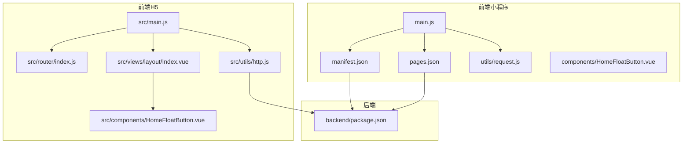
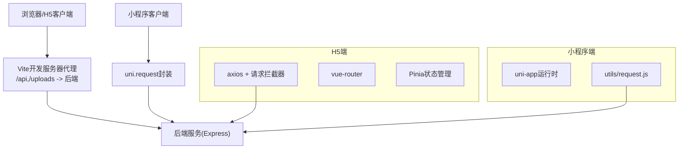
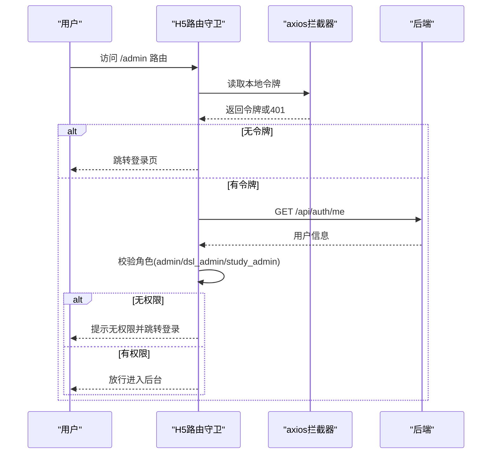
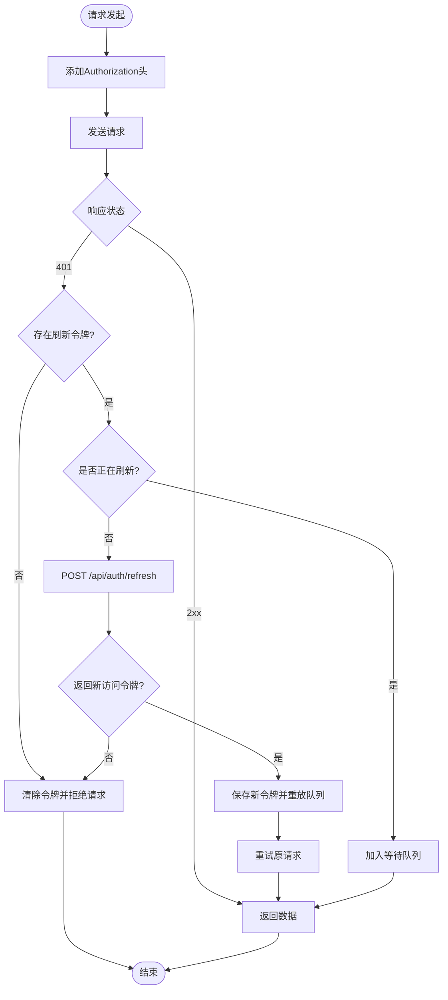
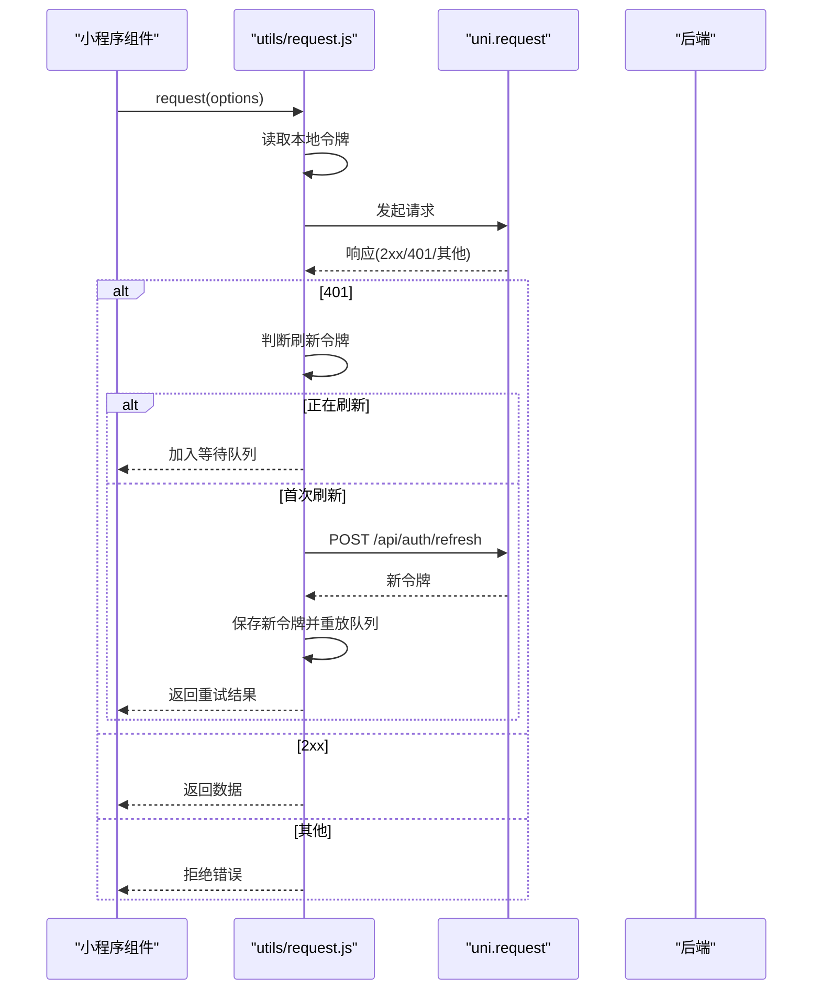
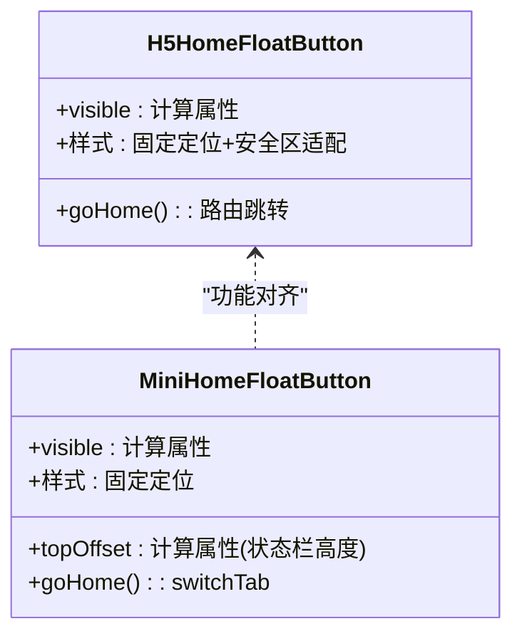
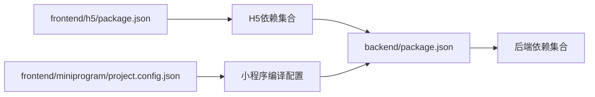

# 多端支持说明

<cite>
**本文引用的文件**
- [frontend/h5/package.json](file://frontend/h5/package.json)
- [frontend/h5/vite.config.js](file://frontend/h5/vite.config.js)
- [frontend/h5/src/main.js](file://frontend/h5/src/main.js)
- [frontend/h5/src/router/index.js](file://frontend/h5/src/router/index.js)
- [frontend/h5/src/utils/http.js](file://frontend/h5/src/utils/http.js)
- [frontend/h5/src/components/HomeFloatButton.vue](file://frontend/h5/src/components/HomeFloatButton.vue)
- [frontend/h5/src/views/layout/Index.vue](file://frontend/h5/src/views/layout/Index.vue)
- [frontend/miniprogram/project.config.json](file://frontend/miniprogram/project.config.json)
- [frontend/miniprogram/manifest.json](file://frontend/miniprogram/manifest.json)
- [frontend/miniprogram/pages.json](file://frontend/miniprogram/pages.json)
- [frontend/miniprogram/main.js](file://frontend/miniprogram/main.js)
- [frontend/miniprogram/utils/request.js](file://frontend/miniprogram/utils/request.js)
- [frontend/miniprogram/components/HomeFloatButton.vue](file://frontend/miniprogram/components/HomeFloatButton.vue)
- [backend/package.json](file://backend/package.json)
</cite>

## 目录
1. [引言](#引言)
2. [项目结构](#项目结构)
3. [核心组件](#核心组件)
4. [架构总览](#架构总览)
5. [详细组件分析](#详细组件分析)
6. [依赖关系分析](#依赖关系分析)
7. [性能考虑](#性能考虑)
8. [故障排查指南](#故障排查指南)
9. [结论](#结论)
10. [附录](#附录)

## 引言
本文件面向低空飞行服务平台的多端支持技术说明，聚焦Web端(H5)、移动端与小程序端的统一技术架构与实现要点。平台采用前后端分离模式，前端以Vue 3为核心，H5端通过Vite构建并结合Vant移动端组件库实现响应式布局；小程序端基于uni-app跨平台框架，统一适配微信、支付宝、百度、字节等小程序生态。文档从架构、组件、数据流、状态管理、API调用差异、UI组件差异、性能优化策略等方面进行系统化阐述，并给出最佳实践与部署建议。

## 项目结构
项目采用多目录分层组织：
- 前端H5：基于Vue 3 + Vite，使用Pinia进行状态管理，Vant作为移动端UI库，路由采用vue-router，全局样式与HTTP拦截器集中管理。
- 前端小程序：基于uni-app，统一页面与组件定义，通过pages.json声明路由与TabBar，使用manifest.json配置多端能力与权限。
- 后端：基于Express + Node.js，提供统一REST接口，支持鉴权、文件上传、数据库访问等能力。

图表来源
- [frontend/h5/src/main.js:1-22](file://frontend/h5/src/main.js#L1-L22)
- [frontend/h5/src/router/index.js:1-227](file://frontend/h5/src/router/index.js#L1-L227)
- [frontend/h5/src/utils/http.js:1-99](file://frontend/h5/src/utils/http.js#L1-L99)
- [frontend/h5/src/views/layout/Index.vue:1-83](file://frontend/h5/src/views/layout/Index.vue#L1-L83)
- [frontend/h5/src/components/HomeFloatButton.vue:1-53](file://frontend/h5/src/components/HomeFloatButton.vue#L1-L53)
- [frontend/miniprogram/main.js:1-22](file://frontend/miniprogram/main.js#L1-L22)
- [frontend/miniprogram/manifest.json:1-73](file://frontend/miniprogram/manifest.json#L1-L73)
- [frontend/miniprogram/pages.json:1-163](file://frontend/miniprogram/pages.json#L1-L163)
- [frontend/miniprogram/utils/request.js:1-144](file://frontend/miniprogram/utils/request.js#L1-L144)
- [frontend/miniprogram/components/HomeFloatButton.vue:1-62](file://frontend/miniprogram/components/HomeFloatButton.vue#L1-L62)
- [backend/package.json:1-34](file://backend/package.json#L1-L34)

章节来源
- [frontend/h5/package.json:1-27](file://frontend/h5/package.json#L1-L27)
- [frontend/h5/vite.config.js:1-54](file://frontend/h5/vite.config.js#L1-L54)
- [frontend/miniprogram/project.config.json:1-35](file://frontend/miniprogram/project.config.json#L1-L35)
- [frontend/miniprogram/manifest.json:1-73](file://frontend/miniprogram/manifest.json#L1-L73)
- [frontend/miniprogram/pages.json:1-163](file://frontend/miniprogram/pages.json#L1-L163)
- [backend/package.json:1-34](file://backend/package.json#L1-L34)

## 核心组件
- H5端核心入口与插件：Vue实例初始化、Pinia状态管理、路由、Vant UI库注册与全局样式注入。
- H5端路由与守卫：统一标题设置、SSO授权码登录、管理员权限校验、动态导入页面组件。
- H5端HTTP拦截与鉴权：请求头携带令牌、401自动刷新令牌、并发请求排队重试、本地存储令牌。
- H5端通用组件：浮动回到首页按钮，适配安全区与触摸反馈。
- H5端布局组件：基于Vant TabBar的底部导航，响应式最大宽度与安全区适配。
- 小程序端入口与运行时：条件编译支持Vue2/Vue3，适配uni-app生命周期与API。
- 小程序端请求封装：基于uni.request的统一封装，支持令牌刷新与并发队列。
- 小程序端页面与TabBar：pages.json声明页面与TabBar，manifest.json配置多端能力。
- 小程序端通用组件：浮动回到首页按钮，基于系统状态栏高度自适应。

章节来源
- [frontend/h5/src/main.js:1-22](file://frontend/h5/src/main.js#L1-L22)
- [frontend/h5/src/router/index.js:1-227](file://frontend/h5/src/router/index.js#L1-L227)
- [frontend/h5/src/utils/http.js:1-99](file://frontend/h5/src/utils/http.js#L1-L99)
- [frontend/h5/src/components/HomeFloatButton.vue:1-53](file://frontend/h5/src/components/HomeFloatButton.vue#L1-L53)
- [frontend/h5/src/views/layout/Index.vue:1-83](file://frontend/h5/src/views/layout/Index.vue#L1-L83)
- [frontend/miniprogram/main.js:1-22](file://frontend/miniprogram/main.js#L1-L22)
- [frontend/miniprogram/utils/request.js:1-144](file://frontend/miniprogram/utils/request.js#L1-L144)
- [frontend/miniprogram/pages.json:1-163](file://frontend/miniprogram/pages.json#L1-L163)
- [frontend/miniprogram/components/HomeFloatButton.vue:1-62](file://frontend/miniprogram/components/HomeFloatButton.vue#L1-L62)

## 架构总览
平台采用“多端共用后端”的统一架构，H5与小程序均通过HTTP接口与后端交互。H5端使用axios与Vite开发服务器代理到后端；小程序端使用uni.request封装统一请求与令牌刷新逻辑。路由与状态管理在两端分别实现，但业务逻辑与数据模型保持一致，便于代码复用与维护。

图表来源
- [frontend/h5/vite.config.js:35-44](file://frontend/h5/vite.config.js#L35-L44)
- [frontend/h5/src/utils/http.js:19-78](file://frontend/h5/src/utils/http.js#L19-L78)
- [frontend/miniprogram/utils/request.js:59-134](file://frontend/miniprogram/utils/request.js#L59-L134)
- [backend/package.json:1-34](file://backend/package.json#L1-L34)

## 详细组件分析

### H5端路由与权限控制
- 路由结构：采用嵌套路由与动态导入，支持服务大厅、全部服务、我的申请、个人中心、后台管理等模块。
- 权限控制：管理员路由需具备有效令牌与角色校验；SSO授权码登录支持两种参数名，登录成功后写入用户信息与令牌并跳转。
- 页面元信息：通过meta字段设置标题与TabBar显示控制，配合布局组件实现统一导航体验。

图表来源
- [frontend/h5/src/router/index.js:184-220](file://frontend/h5/src/router/index.js#L184-L220)

章节来源
- [frontend/h5/src/router/index.js:1-227](file://frontend/h5/src/router/index.js#L1-L227)

### H5端HTTP拦截与令牌刷新
- 请求拦截：自动为每个请求添加Authorization头。
- 响应拦截：对401错误触发刷新流程，使用刷新令牌换取新访问令牌，支持并发请求排队与重试。
- 存储策略：访问令牌与刷新令牌分别持久化，异常时清理令牌并中断后续请求。

图表来源
- [frontend/h5/src/utils/http.js:19-78](file://frontend/h5/src/utils/http.js#L19-L78)

章节来源
- [frontend/h5/src/utils/http.js:1-99](file://frontend/h5/src/utils/http.js#L1-L99)

### 小程序端请求封装与令牌刷新
- 统一入口：基于uni.request封装，支持方法、数据、头部传递。
- 令牌刷新：与H5类似，401时使用刷新令牌换取新访问令牌，支持并发请求排队与重试。
- 存储策略：使用uni的本地存储接口，保证跨端一致性。

图表来源
- [frontend/miniprogram/utils/request.js:59-134](file://frontend/miniprogram/utils/request.js#L59-L134)

章节来源
- [frontend/miniprogram/utils/request.js:1-144](file://frontend/miniprogram/utils/request.js#L1-L144)

### H5端与小程序端通用组件对比
- 浮动回到首页按钮：H5端基于vue-router，使用固定定位与安全区变量；小程序端基于uni-app生命周期与系统状态栏高度计算，使用switchTab切换TabBar页面。
- 两者均提供点击反馈与层级高于内容的设计，确保在不同设备与系统版本下的可用性。

图表来源
- [frontend/h5/src/components/HomeFloatButton.vue:1-53](file://frontend/h5/src/components/HomeFloatButton.vue#L1-L53)
- [frontend/miniprogram/components/HomeFloatButton.vue:1-62](file://frontend/miniprogram/components/HomeFloatButton.vue#L1-L62)

章节来源
- [frontend/h5/src/components/HomeFloatButton.vue:1-53](file://frontend/h5/src/components/HomeFloatButton.vue#L1-L53)
- [frontend/miniprogram/components/HomeFloatButton.vue:1-62](file://frontend/miniprogram/components/HomeFloatButton.vue#L1-L62)

### H5端布局与TabBar
- 布局组件：根据路由meta控制TabBar显示，使用深度选择器适配Vant TabBar样式，支持安全区与最大宽度约束。
- 交互体验：TabBar项包含图标与文字，点击切换对应路由，提升移动端导航效率。

章节来源
- [frontend/h5/src/views/layout/Index.vue:1-83](file://frontend/h5/src/views/layout/Index.vue#L1-L83)

### 小程序端页面与TabBar
- 页面声明：pages.json集中声明页面路径与导航栏样式，支持下拉刷新等特性。
- TabBar：统一配置四个Tab项，文本与跳转路径清晰明确，满足移动端常用功能入口。

章节来源
- [frontend/miniprogram/pages.json:1-163](file://frontend/miniprogram/pages.json#L1-L163)

## 依赖关系分析
- H5端依赖：Vue 3、Pinia、vue-router、Vant、axios、echarts等，构建工具为Vite。
- 小程序端依赖：uni-app运行时与适配层，通过manifest.json启用多端能力与权限。
- 后端依赖：Express、CORS、JSON Web Token、PostgreSQL驱动、文件上传中间件等。

图表来源
- [frontend/h5/package.json:10-25](file://frontend/h5/package.json#L10-L25)
- [frontend/miniprogram/project.config.json:1-35](file://frontend/miniprogram/project.config.json#L1-L35)
- [backend/package.json:12-29](file://backend/package.json#L12-L29)

章节来源
- [frontend/h5/package.json:1-27](file://frontend/h5/package.json#L1-L27)
- [frontend/miniprogram/project.config.json:1-35](file://frontend/miniprogram/project.config.json#L1-L35)
- [backend/package.json:1-34](file://backend/package.json#L1-L34)

## 性能考虑
- H5端构建优化：Vite默认开启代码分割与按需加载；通过Rollup手动分包策略将图表库拆分为独立chunk，减少首屏体积。
- 开发与安全：开发服务器开放主机绑定与代理，同时设置常见安全响应头，降低XSS与点击劫持风险。
- 小程序端优化：通过manifest.json启用压缩与最小化选项，减少包体大小；组件与页面按需引入，避免冗余资源。

章节来源
- [frontend/h5/vite.config.js:22-30](file://frontend/h5/vite.config.js#L22-L30)
- [frontend/h5/vite.config.js:31-51](file://frontend/h5/vite.config.js#L31-L51)
- [frontend/miniprogram/project.config.json:2-25](file://frontend/miniprogram/project.config.json#L2-L25)

## 故障排查指南
- H5端401未刷新：检查本地是否存在刷新令牌，确认拦截器是否正确设置Authorization头，查看刷新接口返回值。
- 小程序端请求失败：检查BASE_URL与后端地址一致性，确认uni.request回调中的状态码与错误信息，排查跨域与域名校验。
- 路由跳转异常：核对路由元信息与TabBar显示控制，确认动态导入组件路径正确。
- 安全区与样式问题：H5端注意使用环境变量适配刘海屏与底部安全区；小程序端通过系统信息读取状态栏高度。

章节来源
- [frontend/h5/src/utils/http.js:19-78](file://frontend/h5/src/utils/http.js#L19-L78)
- [frontend/miniprogram/utils/request.js:59-134](file://frontend/miniprogram/utils/request.js#L59-L134)
- [frontend/h5/src/views/layout/Index.vue:55-80](file://frontend/h5/src/views/layout/Index.vue#L55-L80)
- [frontend/miniprogram/components/HomeFloatButton.vue:14-31](file://frontend/miniprogram/components/HomeFloatButton.vue#L14-L31)

## 结论
平台通过H5与小程序两端统一的后端接口与相近的业务逻辑，实现了多端一致的用户体验。H5端利用Vite与Vant实现快速迭代与良好移动端体验；小程序端依托uni-app实现跨平台统一开发与发布。通过HTTP拦截与令牌刷新机制、路由守卫与权限控制、通用组件与布局规范，平台在不同端之间建立了可复用、可维护的技术基座。

## 附录
- 配置示例与部署要点（概述）
  - H5端：使用Vite开发服务器进行本地调试，生产构建后可通过静态资源服务器部署；代理配置指向后端地址，确保API与上传接口可达。
  - 小程序端：在各平台开发者工具中配置AppID与基础库版本，按pages.json生成页面结构；通过manifest.json启用所需模块与权限。
  - 后端：使用Express启动服务，配置CORS与日志记录；数据库迁移脚本与环境变量需提前准备。

章节来源
- [frontend/h5/vite.config.js:35-44](file://frontend/h5/vite.config.js#L35-L44)
- [frontend/miniprogram/manifest.json:1-73](file://frontend/miniprogram/manifest.json#L1-L73)
- [backend/package.json:6-11](file://backend/package.json#L6-L11)