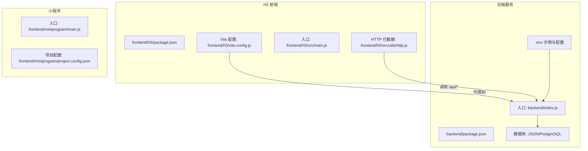
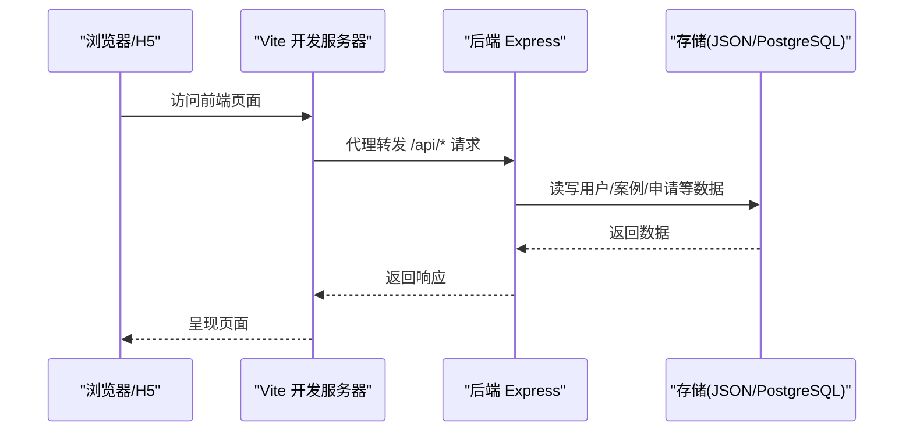
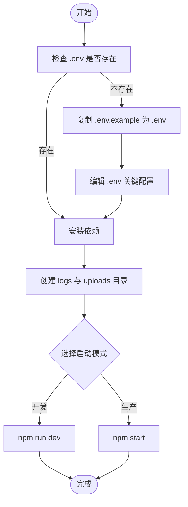
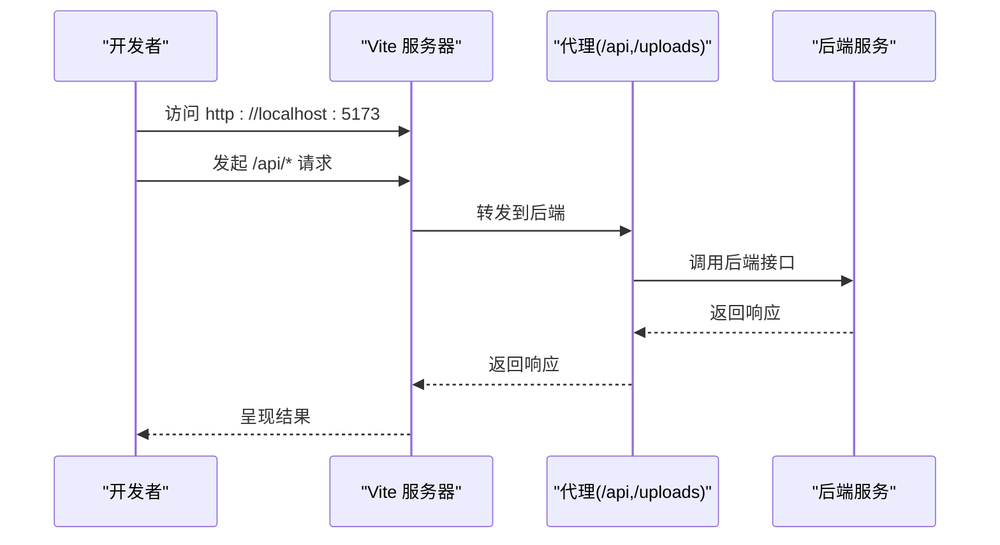
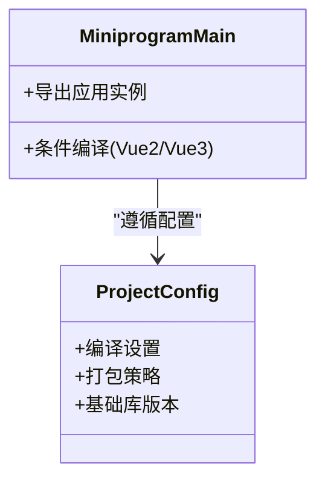
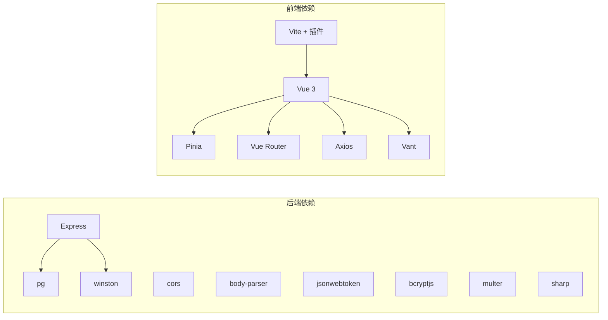

# 快速开始指南

<cite>
**本文引用的文件**
- [backend/package.json](file://backend/package.json)
- [backend/setup.sh](file://backend/setup.sh)
- [backend/setup.bat](file://backend/setup.bat)
- [backend/config.js](file://backend/config.js)
- [backend/.env.example](file://backend/.env.example)
- [backend/index.js](file://backend/index.js)
- [backend/storage.js](file://backend/storage.js)
- [backend/db/schema.sql](file://backend/db/schema.sql)
- [frontend/h5/package.json](file://frontend/h5/package.json)
- [frontend/h5/vite.config.js](file://frontend/h5/vite.config.js)
- [frontend/h5/src/main.js](file://frontend/h5/src/main.js)
- [frontend/h5/src/utils/http.js](file://frontend/h5/src/utils/http.js)
- [frontend/miniprogram/main.js](file://frontend/miniprogram/main.js)
- [frontend/miniprogram/project.config.json](file://frontend/miniprogram/project.config.json)
</cite>

## 目录
1. [简介](#简介)
2. [项目结构](#项目结构)
3. [核心组件](#核心组件)
4. [架构总览](#架构总览)
5. [详细组件分析](#详细组件分析)
6. [依赖关系分析](#依赖关系分析)
7. [性能考虑](#性能考虑)
8. [故障排查指南](#故障排查指南)
9. [结论](#结论)
10. [附录](#附录)

## 简介
本指南面向新加入的开发者，帮助你在最短时间内完成低空飞行服务平台的本地环境准备与项目启动，涵盖后端服务、H5 前端与小程序三部分。你将获得：
- 环境准备清单（含版本建议与安装方式）
- 后端服务启动流程（依赖安装、环境配置、开发/生产模式）
- H5 前端开发环境（Vue 3、Vite、代理与本地开发服务器）
- 小程序开发环境（uni-app、HBuilderX、多端编译）
- 常见问题与排错建议
- 实用工具与调试技巧

## 项目结构
该项目采用前后端分离架构：
- 后端：基于 Node.js + Express 的 REST API 服务，支持本地 JSON 存储与可选 PostgreSQL
- H5 前端：基于 Vue 3 + Vite 的移动端优先单页应用
- 小程序：基于 uni-app 的多端统一工程，适配微信小程序等

图表来源
- [backend/index.js:1-80](file://backend/index.js#L1-L80)
- [backend/config.js:1-123](file://backend/config.js#L1-L123)
- [frontend/h5/vite.config.js:35-44](file://frontend/h5/vite.config.js#L35-L44)
- [frontend/h5/src/utils/http.js:19-78](file://frontend/h5/src/utils/http.js#L19-L78)
- [frontend/h5/src/main.js:1-22](file://frontend/h5/src/main.js#L1-L22)
- [frontend/miniprogram/main.js:1-22](file://frontend/miniprogram/main.js#L1-L22)
- [frontend/miniprogram/project.config.json:1-35](file://frontend/miniprogram/project.config.json#L1-L35)

章节来源
- [backend/package.json:1-34](file://backend/package.json#L1-L34)
- [frontend/h5/package.json:1-27](file://frontend/h5/package.json#L1-L27)

## 核心组件
- 后端服务
  - 使用 dotenv 管理环境变量，集中配置 JWT、微信、SSO、数据库、上传、服务器等参数
  - 提供认证接口（登录、注册、刷新、登出）、文件上传、图片压缩、SSO 授权等能力
  - 支持本地 JSON 文件存储与可选 PostgreSQL（json_store 表）
- H5 前端
  - Vue 3 + Vite，内置代理到后端 /api 与 /uploads
  - Pinia 状态管理、路由、Vant UI 组件库
  - Axios 拦截器自动处理 401 与 Token 刷新
- 小程序
  - uni-app 工程，HBuilderX 中创建与编译
  - 项目配置文件定义编译选项与基础库版本

章节来源
- [backend/config.js:1-123](file://backend/config.js#L1-L123)
- [backend/index.js:434-693](file://backend/index.js#L434-L693)
- [backend/storage.js:1-197](file://backend/storage.js#L1-L197)
- [frontend/h5/vite.config.js:35-44](file://frontend/h5/vite.config.js#L35-L44)
- [frontend/h5/src/utils/http.js:19-78](file://frontend/h5/src/utils/http.js#L19-L78)
- [frontend/miniprogram/main.js:1-22](file://frontend/miniprogram/main.js#L1-L22)

## 架构总览
下图展示了从浏览器到后端再到存储的整体链路，以及 H5 前端与后端之间的请求代理关系。

图表来源
- [frontend/h5/vite.config.js:35-44](file://frontend/h5/vite.config.js#L35-L44)
- [backend/index.js:425-432](file://backend/index.js#L425-L432)
- [backend/storage.js:134-181](file://backend/storage.js#L134-L181)

## 详细组件分析

### 后端服务：环境准备与启动
- 环境要求
  - Node.js：使用 package.json 中的依赖版本范围，建议使用当前 LTS 版本
  - npm：随 Node.js 附带
  - 可选：PostgreSQL（启用后端配置中的 PostgreSQL 选项）
- 快速配置脚本
  - Windows：使用批处理脚本一键创建 .env、安装依赖、创建日志与上传目录
  - Linux/macOS：使用 shell 脚本执行相同流程
- 启动方式
  - 开发模式：使用 nodemon 自动重启
  - 生产模式：直接运行 Node 入口文件
- 关键配置项（来自 .env.example 与 config.js）
  - 服务器端口、CORS、基础 URL、前端 URL
  - JWT 密钥与有效期
  - 微信小程序/公众号 AppID 与密钥
  - SSO 接口地址与密钥
  - PostgreSQL 连接参数（可选）
  - 文件上传目录、大小与类型限制
  - 日志级别与目录
- 数据存储
  - 默认使用本地 JSON 文件；可切换为 PostgreSQL（json_store 表）

图表来源
- [backend/setup.sh:9-58](file://backend/setup.sh#L9-L58)
- [backend/setup.bat:7-57](file://backend/setup.bat#L7-L57)
- [backend/package.json:6-11](file://backend/package.json#L6-L11)

章节来源
- [backend/setup.sh:1-58](file://backend/setup.sh#L1-L58)
- [backend/setup.bat:1-57](file://backend/setup.bat#L1-L57)
- [backend/.env.example:1-104](file://backend/.env.example#L1-L104)
- [backend/config.js:1-123](file://backend/config.js#L1-L123)
- [backend/package.json:1-34](file://backend/package.json#L1-L34)

### H5 前端：Vue 3 + Vite
- 初始化与依赖
  - 使用 package.json 中的脚本与依赖进行安装与构建
- 本地开发
  - Vite 默认端口与主机绑定，支持代理到后端
  - 代理规则将 /api 与 /uploads 转发到后端服务
- 状态与网络
  - Pinia 状态管理、Vue Router 路由
  - Axios 拦截器自动注入 Authorization 头，并在 401 时尝试刷新令牌
- 入口与插件
  - main.js 注册 Pinia、路由、Vant UI
  - vite.config.js 配置别名、分包策略与安全响应头

图表来源
- [frontend/h5/vite.config.js:35-44](file://frontend/h5/vite.config.js#L35-L44)
- [frontend/h5/src/utils/http.js:19-78](file://frontend/h5/src/utils/http.js#L19-L78)
- [frontend/h5/src/main.js:14-20](file://frontend/h5/src/main.js#L14-L20)

章节来源
- [frontend/h5/package.json:1-27](file://frontend/h5/package.json#L1-L27)
- [frontend/h5/vite.config.js:1-54](file://frontend/h5/vite.config.js#L1-L54)
- [frontend/h5/src/main.js:1-22](file://frontend/h5/src/main.js#L1-L22)
- [frontend/h5/src/utils/http.js:1-99](file://frontend/h5/src/utils/http.js#L1-L99)

### 小程序：uni-app 与 HBuilderX
- 工程入口
  - main.js 支持 Vue 2/3 条件编译，导出应用实例
- 项目配置
  - project.config.json 控制编译选项、打包策略与基础库版本
- 开发流程
  - 在 HBuilderX 中打开项目，选择目标平台进行编译与预览
  - 使用 uni-app 的跨端能力适配微信小程序等多端

图表来源
- [frontend/miniprogram/main.js:1-22](file://frontend/miniprogram/main.js#L1-L22)
- [frontend/miniprogram/project.config.json:1-35](file://frontend/miniprogram/project.config.json#L1-L35)

章节来源
- [frontend/miniprogram/main.js:1-22](file://frontend/miniprogram/main.js#L1-L22)
- [frontend/miniprogram/project.config.json:1-35](file://frontend/miniprogram/project.config.json#L1-L35)

## 依赖关系分析
- 后端依赖
  - Web 框架与中间件：Express、cors、body-parser
  - 安全与加密：bcryptjs、jsonwebtoken、sm-crypto、gm-crypto
  - 文件处理：multer、sharp
  - 数据库：pg（可选 PostgreSQL）
  - 日志：winston
- 前端依赖
  - 运行时：Vue 3、Pinia、Vue Router、Axios
  - UI：Vant
  - 构建：Vite、@vitejs/plugin-vue
- 存储
  - 本地：JSON 文件
  - 可选：PostgreSQL（json_store 表）

图表来源
- [backend/package.json:12-32](file://backend/package.json#L12-L32)
- [frontend/h5/package.json:10-25](file://frontend/h5/package.json#L10-L25)

章节来源
- [backend/package.json:1-34](file://backend/package.json#L1-L34)
- [frontend/h5/package.json:1-27](file://frontend/h5/package.json#L1-L27)

## 性能考虑
- 图片压缩：后端提供 /api/image 接口，支持按宽度与质量压缩，失败时回退原图并设置缓存头
- 缓存策略：存储层对用户、案例、申请、服务配置、评论等数据设置不同 TTL 的内存缓存
- 构建优化：Vite 配置手动分包，将图表相关依赖单独拆分，减少首屏体积
- 代理与安全：Vite 服务器开启安全响应头，代理仅转发 /api 与 /uploads，降低跨域与中间人风险

章节来源
- [backend/index.js:86-114](file://backend/index.js#L86-L114)
- [backend/storage.js:134-181](file://backend/storage.js#L134-L181)
- [frontend/h5/vite.config.js:22-30](file://frontend/h5/vite.config.js#L22-L30)
- [frontend/h5/vite.config.js:45-50](file://frontend/h5/vite.config.js#L45-L50)

## 故障排查指南
- 启动后端报错（缺少 .env 或配置项）
  - 使用脚本自动生成 .env 并按提示填写关键配置（JWT_SECRET、管理员密码、微信 AppID/Secret、SSO 参数、数据库连接）
  - 检查环境变量是否加载成功（打印配置信息）
- 前端 401 与 Token 刷新失败
  - 确认后端 /api/auth/refresh 接口可用，检查本地存储的刷新令牌是否存在
  - 检查代理是否正确转发到后端（Vite 代理 /api 与 /uploads）
- 图片压缩失败
  - 后端会回退到原始图片并设置较短缓存时间，确认 sharp 依赖安装与图片路径有效
- 数据库切换
  - 如启用 PostgreSQL，确保 json_store 表存在；如使用 DATABASE_URL，需满足连接字符串格式

章节来源
- [backend/setup.sh:9-24](file://backend/setup.sh#L9-L24)
- [backend/setup.bat:7-22](file://backend/setup.bat#L7-L22)
- [backend/.env.example:16-18](file://backend/.env.example#L16-L18)
- [backend/config.js:78-104](file://backend/config.js#L78-L104)
- [frontend/h5/vite.config.js:35-44](file://frontend/h5/vite.config.js#L35-L44)
- [frontend/h5/src/utils/http.js:58-78](file://frontend/h5/src/utils/http.js#L58-L78)
- [backend/index.js:95-114](file://backend/index.js#L95-L114)
- [backend/db/schema.sql:1-10](file://backend/db/schema.sql#L1-L10)

## 结论
按照本指南完成环境准备与启动后，你将可以：
- 成功运行后端服务并访问 API
- 在 H5 前端进行本地开发与调试
- 在 HBuilderX 中编译并预览小程序
- 体验完整的登录、上传、图片压缩与数据存储流程

## 附录

### 环境准备清单
- Node.js：使用当前 LTS 版本
- npm：随 Node.js 附带
- 可选：PostgreSQL（启用后端配置中的 PostgreSQL 选项）
- 可选：HBuilderX（用于小程序开发与多端编译）

章节来源
- [backend/package.json:12-32](file://backend/package.json#L12-L32)
- [frontend/h5/package.json:10-25](file://frontend/h5/package.json#L10-L25)

### 后端启动步骤
- Windows：双击批处理脚本，按提示编辑 .env，完成后根据脚本输出启动开发或生产模式
- Linux/macOS：赋予脚本执行权限，运行后按提示编辑 .env，再执行相应启动命令
- 开发模式：使用 nodemon 自动重启
- 生产模式：直接运行 Node 入口文件

章节来源
- [backend/setup.sh:1-58](file://backend/setup.sh#L1-L58)
- [backend/setup.bat:1-57](file://backend/setup.bat#L1-L57)
- [backend/package.json:6-11](file://backend/package.json#L6-L11)

### H5 前端启动步骤
- 安装依赖后，使用 Vite 启动本地开发服务器
- 通过代理访问后端 API 与上传资源
- 使用 Axios 拦截器自动处理鉴权与刷新

章节来源
- [frontend/h5/package.json:5-9](file://frontend/h5/package.json#L5-L9)
- [frontend/h5/vite.config.js:31-44](file://frontend/h5/vite.config.js#L31-L44)
- [frontend/h5/src/utils/http.js:19-78](file://frontend/h5/src/utils/http.js#L19-L78)

### 小程序开发与编译
- 在 HBuilderX 中打开项目，依据项目配置进行编译与预览
- 使用 uni-app 的跨端能力适配多端

章节来源
- [frontend/miniprogram/project.config.json:26-35](file://frontend/miniprogram/project.config.json#L26-L35)
- [frontend/miniprogram/main.js:14-22](file://frontend/miniprogram/main.js#L14-L22)