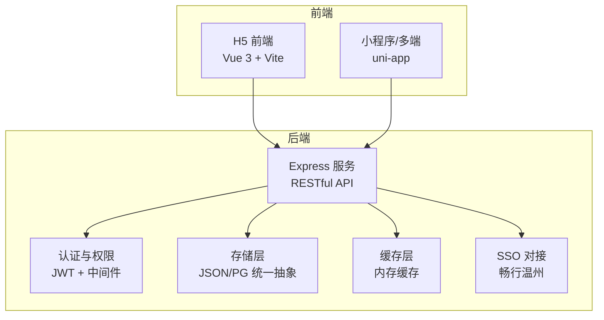
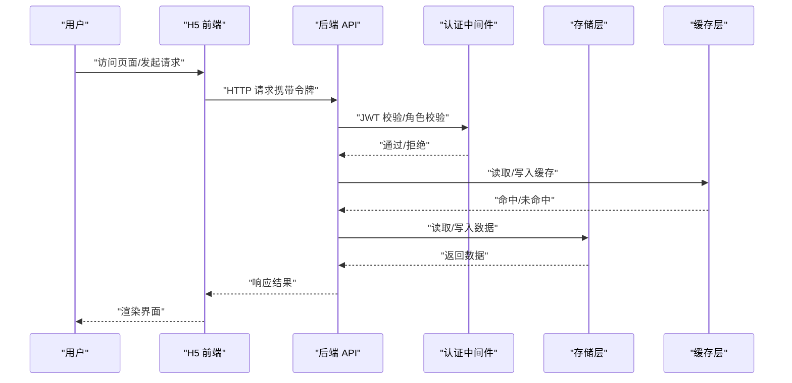
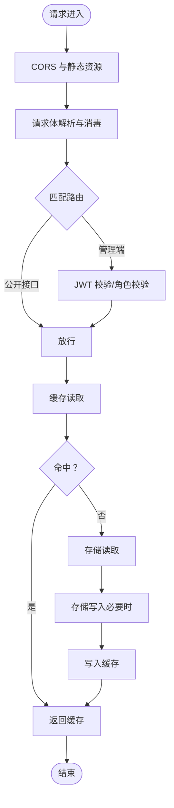
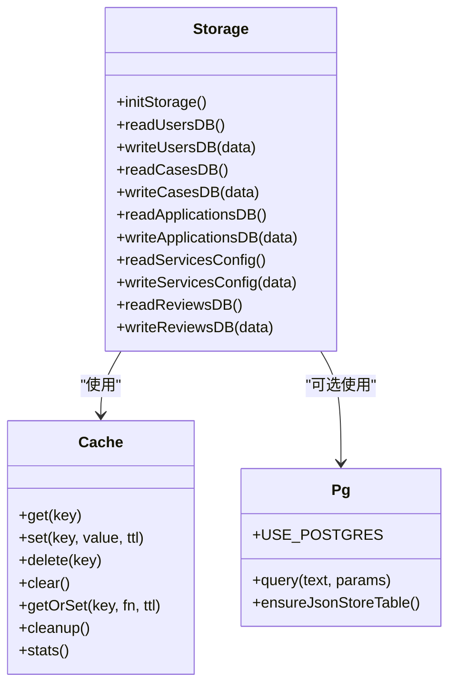
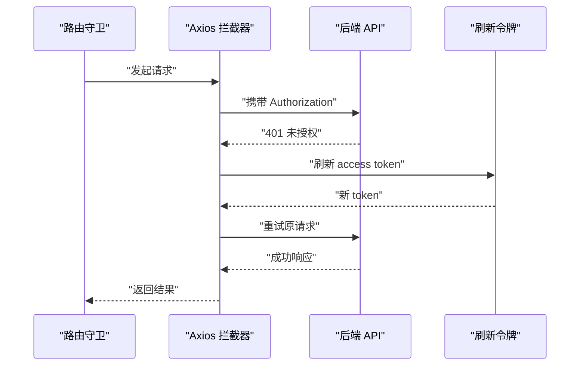
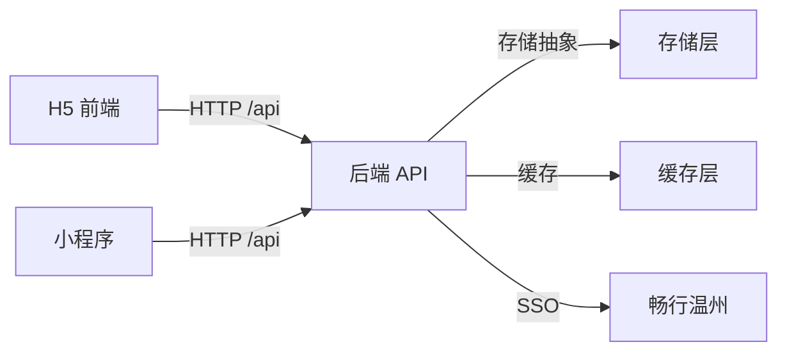

# 技术架构概览

<cite>
**本文引用的文件**
- [backend/package.json](file://backend/package.json)
- [frontend/h5/package.json](file://frontend/h5/package.json)
- [backend/index.js](file://backend/index.js)
- [backend/config.js](file://backend/config.js)
- [backend/db/schema.sql](file://backend/db/schema.sql)
- [backend/cache.js](file://backend/cache.js)
- [backend/storage.js](file://backend/storage.js)
- [backend/db/pg.js](file://backend/db/pg.js)
- [backend/routes/admin.js](file://backend/routes/admin.js)
- [backend/middleware/auth.js](file://backend/middleware/auth.js)
- [backend/platformAuth.js](file://backend/platformAuth.js)
- [frontend/h5/src/main.js](file://frontend/h5/src/main.js)
- [frontend/h5/vite.config.js](file://frontend/h5/vite.config.js)
- [frontend/h5/src/router/index.js](file://frontend/h5/src/router/index.js)
- [frontend/h5/src/utils/http.js](file://frontend/h5/src/utils/http.js)
- [frontend/miniprogram/main.js](file://frontend/miniprogram/main.js)
- [frontend/miniprogram/manifest.json](file://frontend/miniprogram/manifest.json)
- [frontend/miniprogram/pages.json](file://frontend/miniprogram/pages.json)
</cite>

## 目录
1. [引言](#引言)
2. [项目结构](#项目结构)
3. [核心组件](#核心组件)
4. [架构总览](#架构总览)
5. [详细组件分析](#详细组件分析)
6. [依赖关系分析](#依赖关系分析)
7. [性能考量](#性能考量)
8. [故障排查指南](#故障排查指南)
9. [结论](#结论)
10. [附录](#附录)

## 引言
本文件面向低空飞行服务平台的整体技术架构，系统性阐述后端基于 Node.js + Express 的 RESTful API 架构、前端采用 Vue 3 + Vite 的现代化前端架构、移动端基于 uni-app 的跨平台解决方案。重点说明多端统一的技术架构优势、代码复用与统一管理策略；详解数据库选型（PostgreSQL 与 JSON 文件双模式）、缓存策略、文件存储方案；解释前后端分离架构的优势与控制流；并提供技术栈对比分析与系统边界划分、组件交互关系图，帮助开发者快速理解整体设计思路。

## 项目结构
项目采用“前后端分离 + 多端统一”的组织方式：
- 后端：Node.js + Express，提供 RESTful API，负责业务逻辑、认证鉴权、SSO 对接、数据持久化与缓存。
- 前端 H5：Vue 3 + Vite，提供 Web 端交互界面，路由守卫、HTTP 拦截器与 Pinia 状态管理。
- 移动端：uni-app，统一适配小程序、App 等多端，共享业务逻辑与页面结构。
- 数据层：支持 JSON 文件存储与 PostgreSQL 双模式，通过统一存储抽象屏蔽差异。

图表来源
- [backend/index.js:1-1401](file://backend/index.js#L1-L1401)
- [frontend/h5/src/main.js:1-22](file://frontend/h5/src/main.js#L1-L22)
- [frontend/miniprogram/main.js:1-22](file://frontend/miniprogram/main.js#L1-L22)

章节来源
- [backend/package.json:1-34](file://backend/package.json#L1-L34)
- [frontend/h5/package.json:1-27](file://frontend/h5/package.json#L1-L27)

## 核心组件
- 后端服务与路由
  - Express 应用初始化、CORS、静态资源、请求体解析、日志中间件、图片压缩与上传接口。
  - 认证中间件（JWT 校验、可选认证、角色校验、速率限制）。
  - 管理端路由（仪表盘、申请管理、用户管理、服务配置、评价管理、导出等）。
- 存储与缓存
  - 统一存储抽象：支持 JSON 文件与 PostgreSQL（JSONB）双模式，自动迁移与兼容。
  - 内存缓存：按键空间缓存，带 TTL 与清理策略，显著降低文件读写压力。
- 前端 H5
  - 应用入口、路由配置、HTTP 拦截器（自动刷新令牌）、Pinia 状态管理、UI 组件库集成。
- 前端小程序（uni-app）
  - 应用入口、页面配置、导航栏与 TabBar 配置、页面路由映射。
- SSO 对接
  - 与“畅行温州”平台的双向加密与签名流程，支持授权码换取会员信息与登录态。

章节来源
- [backend/index.js:1-1401](file://backend/index.js#L1-L1401)
- [backend/middleware/auth.js:1-168](file://backend/middleware/auth.js#L1-L168)
- [backend/routes/admin.js:1-514](file://backend/routes/admin.js#L1-L514)
- [backend/storage.js:1-197](file://backend/storage.js#L1-L197)
- [backend/cache.js:1-119](file://backend/cache.js#L1-L119)
- [backend/db/pg.js:1-56](file://backend/db/pg.js#L1-L56)
- [frontend/h5/src/main.js:1-22](file://frontend/h5/src/main.js#L1-L22)
- [frontend/h5/src/router/index.js:1-227](file://frontend/h5/src/router/index.js#L1-L227)
- [frontend/h5/src/utils/http.js:1-99](file://frontend/h5/src/utils/http.js#L1-L99)
- [frontend/miniprogram/main.js:1-22](file://frontend/miniprogram/main.js#L1-L22)
- [frontend/miniprogram/pages.json:1-163](file://frontend/miniprogram/pages.json#L1-L163)
- [backend/platformAuth.js:1-177](file://backend/platformAuth.js#L1-L177)

## 架构总览
系统采用前后端分离与多端统一的架构设计：
- 前端通过 HTTP 与后端交互，H5 与小程序共享同一套后端 API。
- 后端提供统一的 RESTful 接口，内部通过中间件实现认证、鉴权与输入清洗。
- 数据层通过统一存储抽象屏蔽底层差异，支持 JSON 文件与 PostgreSQL 双模式，便于平滑演进。
- 缓存层减少热点数据的文件读写，提升响应速度与吞吐。
- SSO 对接确保与外部平台的互操作性，支持多种登录方式与授权码流转。

图表来源
- [backend/middleware/auth.js:1-168](file://backend/middleware/auth.js#L1-L168)
- [backend/storage.js:1-197](file://backend/storage.js#L1-L197)
- [backend/cache.js:1-119](file://backend/cache.js#L1-L119)
- [frontend/h5/src/utils/http.js:1-99](file://frontend/h5/src/utils/http.js#L1-L99)

## 详细组件分析

### 后端服务与路由
- 服务启动与中间件
  - 加载环境变量、初始化 Express、启用 CORS、静态资源、请求体解析、输入消毒、请求日志。
  - 图片压缩与上传接口，支持缩略图生成与缓存头设置。
- 认证与权限
  - JWT 令牌签发与刷新、可选认证、角色白名单校验、速率限制。
- 管理端路由
  - 仪表盘统计、申请列表与状态变更、Excel 导出、用户角色管理、服务配置分角色隔离、评价审核与删除。
- SSO 对接
  - 与“畅行温州”平台的双向加解密与签名，支持授权码换取会员信息与登录态。

图表来源
- [backend/index.js:1-1401](file://backend/index.js#L1-L1401)
- [backend/middleware/auth.js:1-168](file://backend/middleware/auth.js#L1-L168)
- [backend/storage.js:1-197](file://backend/storage.js#L1-L197)
- [backend/cache.js:1-119](file://backend/cache.js#L1-L119)

章节来源
- [backend/index.js:1-1401](file://backend/index.js#L1-L1401)
- [backend/middleware/auth.js:1-168](file://backend/middleware/auth.js#L1-L168)
- [backend/routes/admin.js:1-514](file://backend/routes/admin.js#L1-L514)
- [backend/platformAuth.js:1-177](file://backend/platformAuth.js#L1-L177)

### 存储与缓存
- 存储抽象
  - JSON 文件模式：初始化多个 JSON 文件作为表，提供读写封装。
  - PostgreSQL 模式：使用 JSONB 存储，建表与查询由 pg 模块提供。
  - 统一键空间：applications、cases、users、services_config、reviews。
- 缓存策略
  - 内存 Map 实现，支持 TTL、清理过期、统计信息。
  - 不同数据域设置不同 TTL：用户与申请 1 分钟，案例与服务配置 5 分钟。
  - 写入时主动失效对应缓存键，保证一致性。

图表来源
- [backend/cache.js:1-119](file://backend/cache.js#L1-L119)
- [backend/storage.js:1-197](file://backend/storage.js#L1-L197)
- [backend/db/pg.js:1-56](file://backend/db/pg.js#L1-L56)

章节来源
- [backend/storage.js:1-197](file://backend/storage.js#L1-L197)
- [backend/cache.js:1-119](file://backend/cache.js#L1-L119)
- [backend/db/pg.js:1-56](file://backend/db/pg.js#L1-L56)
- [backend/db/schema.sql:1-10](file://backend/db/schema.sql#L1-L10)

### 前端 H5（Vue 3 + Vite）
- 应用入口与插件
  - 创建 Vue 应用，挂载 Pinia、路由、Vant UI。
- 路由与守卫
  - 定义主路由与管理端路由，前置守卫处理登录态、权限校验与 SSO 授权码处理。
- HTTP 与令牌刷新
  - Axios 请求拦截器自动附加 Bearer 令牌，响应拦截器处理 401 并触发刷新流程，支持并发请求排队与重试。

图表来源
- [frontend/h5/src/router/index.js:155-223](file://frontend/h5/src/router/index.js#L155-L223)
- [frontend/h5/src/utils/http.js:1-99](file://frontend/h5/src/utils/http.js#L1-L99)

章节来源
- [frontend/h5/src/main.js:1-22](file://frontend/h5/src/main.js#L1-L22)
- [frontend/h5/src/router/index.js:1-227](file://frontend/h5/src/router/index.js#L1-L227)
- [frontend/h5/src/utils/http.js:1-99](file://frontend/h5/src/utils/http.js#L1-L99)
- [frontend/h5/vite.config.js:1-54](file://frontend/h5/vite.config.js#L1-L54)

### 前端小程序（uni-app）
- 应用入口
  - 支持 Vue 2/3 双入口适配，创建应用实例。
- 页面与导航
  - pages.json 定义页面路径、导航栏与 TabBar，统一标题与样式风格。
- 与后端交互
  - 通过相同 API 与后端交互，共享登录态与业务逻辑。

章节来源
- [frontend/miniprogram/main.js:1-22](file://frontend/miniprogram/main.js#L1-L22)
- [frontend/miniprogram/pages.json:1-163](file://frontend/miniprogram/pages.json#L1-L163)
- [frontend/miniprogram/manifest.json:1-73](file://frontend/miniprogram/manifest.json#L1-L73)

### SSO 对接（畅行温州）
- 功能概述
  - 支持授权码换取会员信息与登录态，兼容两种参数名。
  - 与后端 SSO 接口配合，完成第三方登录与用户信息同步。
- 安全机制
  - 基于 SM2/SM4 的双向加解密与签名，保障数据传输安全。

章节来源
- [backend/index.js:478-569](file://backend/index.js#L478-L569)
- [backend/platformAuth.js:1-177](file://backend/platformAuth.js#L1-L177)

## 依赖关系分析
- 技术栈与依赖
  - 后端：Express、JWT、Multer、Sharp、Axios、Winston、bcryptjs、lowdb、xlsx、pg 等。
  - 前端 H5：Vue 3、Vue Router、Pinia、Vant、axios、vue-echarts、Leaflet 等。
  - 前端小程序：uni-app 生态、基础适配层。
- 系统耦合度
  - 前后端通过 RESTful API 解耦，前端通过代理转发 /api 与 /uploads。
  - 存储层通过统一抽象屏蔽底层差异，便于切换数据库类型。
  - 认证中间件集中管理，避免重复实现。

图表来源
- [frontend/h5/vite.config.js:35-44](file://frontend/h5/vite.config.js#L35-L44)
- [backend/index.js:1-1401](file://backend/index.js#L1-L1401)
- [backend/storage.js:1-197](file://backend/storage.js#L1-L197)
- [backend/cache.js:1-119](file://backend/cache.js#L1-L119)
- [backend/platformAuth.js:1-177](file://backend/platformAuth.js#L1-L177)

章节来源
- [backend/package.json:1-34](file://backend/package.json#L1-L34)
- [frontend/h5/package.json:1-27](file://frontend/h5/package.json#L1-L27)
- [frontend/h5/vite.config.js:1-54](file://frontend/h5/vite.config.js#L1-L54)

## 性能考量
- 缓存策略
  - 针对高频读取的数据（用户、申请、案例、服务配置）设置合理 TTL，显著降低存储层压力。
  - 写入时主动失效缓存键，保证一致性与实时性。
- 文件与图片处理
  - 图片压缩接口支持动态尺寸与质量参数，设置合适的缓存头，减少重复计算与带宽消耗。
- 数据库演进
  - 当前以 JSON 文件为主，具备平滑迁移到 PostgreSQL 的能力；PG 模式下使用 JSONB 存储，便于未来规范化。
- 前端构建优化
  - Vite 构建按需拆包，手动分包策略减少大依赖体积，提升首屏性能。

章节来源
- [backend/cache.js:1-119](file://backend/cache.js#L1-L119)
- [backend/index.js:86-114](file://backend/index.js#L86-L114)
- [backend/db/schema.sql:1-10](file://backend/db/schema.sql#L1-L10)
- [frontend/h5/vite.config.js:22-30](file://frontend/h5/vite.config.js#L22-L30)

## 故障排查指南
- 认证问题
  - 401 未授权：检查前端是否携带有效令牌；确认后端 JWT 密钥与过期时间配置。
  - 令牌过期：利用刷新接口获取新令牌，注意并发请求的排队与重试。
- 存储问题
  - JSON 文件读写失败：检查文件权限与磁盘空间；确认存储初始化是否执行。
  - PostgreSQL 连接失败：检查连接参数与 SSL 配置；确认表是否存在。
- SSO 接口
  - 授权码无效或平台返回失败：检查平台配置、SM2/SM4 密钥与签名内容；查看调试日志。
- 前端代理
  - /api 与 /uploads 代理未生效：确认 Vite 代理配置与目标地址一致。

章节来源
- [backend/middleware/auth.js:1-168](file://backend/middleware/auth.js#L1-L168)
- [frontend/h5/src/utils/http.js:1-99](file://frontend/h5/src/utils/http.js#L1-L99)
- [backend/storage.js:1-197](file://backend/storage.js#L1-L197)
- [backend/db/pg.js:1-56](file://backend/db/pg.js#L1-L56)
- [backend/platformAuth.js:1-177](file://backend/platformAuth.js#L1-L177)
- [frontend/h5/vite.config.js:35-44](file://frontend/h5/vite.config.js#L35-L44)

## 结论
本项目通过“前后端分离 + 多端统一”的架构设计，实现了高内聚、低耦合的系统结构。后端以 Express 为核心，结合中间件与统一存储抽象，兼顾易用性与可演进性；前端 H5 与小程序共享 API 与业务逻辑，最大化代码复用。数据库支持 JSON 与 PostgreSQL 双模式，缓存层提升性能，SSO 对接增强生态互通。整体架构清晰、扩展性强，适合持续迭代与规模化部署。

## 附录
- 环境变量与配置
  - JWT 密钥、过期时间、管理员账号、微信小程序与公众号配置、SSO 平台参数、数据库连接与上传配置等。
- 部署建议
  - 前端 H5 建议使用 Nginx 或静态托管；后端建议容器化部署，配置健康检查与日志采集；数据库根据规模选择 PostgreSQL 并开启备份与监控。

章节来源
- [backend/config.js:1-123](file://backend/config.js#L1-L123)