# 核心功能特性

<cite>
**本文引用的文件**
- [backend/index.js](file://backend/index.js)
- [backend/routes/admin.js](file://backend/routes/admin.js)
- [backend/routes/auth.js](file://backend/routes/auth.js)
- [frontend/h5/src/router/index.js](file://frontend/h5/src/router/index.js)
- [frontend/h5/src/utils/http.js](file://frontend/h5/src/utils/http.js)
- [frontend/h5/src/views/services/Index.vue](file://frontend/h5/src/views/services/Index.vue)
- [frontend/h5/src/views/services/Apply.vue](file://frontend/h5/src/views/services/Apply.vue)
- [frontend/h5/src/views/applications/Index.vue](file://frontend/h5/src/views/applications/Index.vue)
- [frontend/h5/src/views/mine/Index.vue](file://frontend/h5/src/views/mine/Index.vue)
- [frontend/h5/src/views/cases/Index.vue](file://frontend/h5/src/views/cases/Index.vue)
- [frontend/h5/src/views/admin/Dashboard.vue](file://frontend/h5/src/views/admin/Dashboard.vue)
- [frontend/h5/src/views/admin/orders/OrderList.vue](file://frontend/h5/src/views/admin/orders/OrderList.vue)
- [frontend/h5/src/views/admin/cases/CaseList.vue](file://frontend/h5/src/views/admin/cases/CaseList.vue)
- [frontend/h5/src/stores/service.js](file://frontend/h5/src/stores/service.js)
- [frontend/h5/src/stores/application.js](file://frontend/h5/src/stores/application.js)
</cite>

## 目录
1. [引言](#引言)
2. [项目结构](#项目结构)
3. [核心组件](#核心组件)
4. [架构总览](#架构总览)
5. [详细组件分析](#详细组件分析)
6. [依赖分析](#依赖分析)
7. [性能考虑](#性能考虑)
8. [故障排查指南](#故障排查指南)
9. [结论](#结论)
10. [附录](#附录)

## 引言
本文件面向开发者与产品人员，系统性梳理低空飞行服务平台的核心功能特性与业务闭环，围绕12项核心服务的业务逻辑与实现方式进行深入解析，并覆盖用户侧功能（服务大厅、全部服务、我的申请、个人中心、登录注册）与后台管理功能（案例管理、申请管理）。文档同时给出数据流、调用序列与时序图，帮助快速理解系统设计与实现要点。

## 项目结构
平台采用前后端分离架构：
- 后端基于 Node.js + Express，提供认证、服务配置、案例、申请、统计等接口。
- 前端采用 Vue 3 + Vant UI + Pinia，提供 H5 端与后台管理界面。
- 数据持久化采用本地 JSON 文件存储（默认），亦支持 PostgreSQL（由配置驱动）。

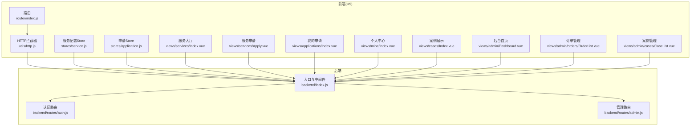

图表来源
- [frontend/h5/src/router/index.js:1-227](file://frontend/h5/src/router/index.js#L1-L227)
- [frontend/h5/src/utils/http.js:1-99](file://frontend/h5/src/utils/http.js#L1-L99)
- [backend/index.js:1-1401](file://backend/index.js#L1-L1401)
- [backend/routes/auth.js:1-591](file://backend/routes/auth.js#L1-L591)
- [backend/routes/admin.js:1-514](file://backend/routes/admin.js#L1-L514)

章节来源
- [frontend/h5/src/router/index.js:1-227](file://frontend/h5/src/router/index.js#L1-L227)
- [frontend/h5/src/utils/http.js:1-99](file://frontend/h5/src/utils/http.js#L1-L99)
- [backend/index.js:1-1401](file://backend/index.js#L1-L1401)

## 核心组件
- 认证与安全：JWT 登录、刷新、登出、SSO、微信登录、速率限制与输入清洗。
- 服务配置与展示：服务配置的分级管理（管理员/DSL管理员/研学管理员），前端动态拉取与展示。
- 申请与工单：统一的申请表单、状态流转、后台批量处理与导出。
- 案例管理：案例的增删改查、媒体资源上传与归一化。
- 数据统计：后台仪表盘聚合指标与图表展示。
- 前端状态管理：Pinia Store 管理服务配置与申请列表状态。

章节来源
- [backend/routes/auth.js:1-591](file://backend/routes/auth.js#L1-L591)
- [backend/routes/admin.js:1-514](file://backend/routes/admin.js#L1-L514)
- [frontend/h5/src/stores/service.js:1-164](file://frontend/h5/src/stores/service.js#L1-L164)
- [frontend/h5/src/stores/application.js:1-177](file://frontend/h5/src/stores/application.js#L1-L177)

## 架构总览
平台遵循“前端路由 + Axios 拦截器 + 后端 REST API”的标准 SPA 架构。前端通过拦截器自动注入 Authorization 头，后端通过 JWT 验证与角色控制访问权限。管理端通过角色限定（admin/dsl_admin/study_admin）实现数据隔离与功能权限。

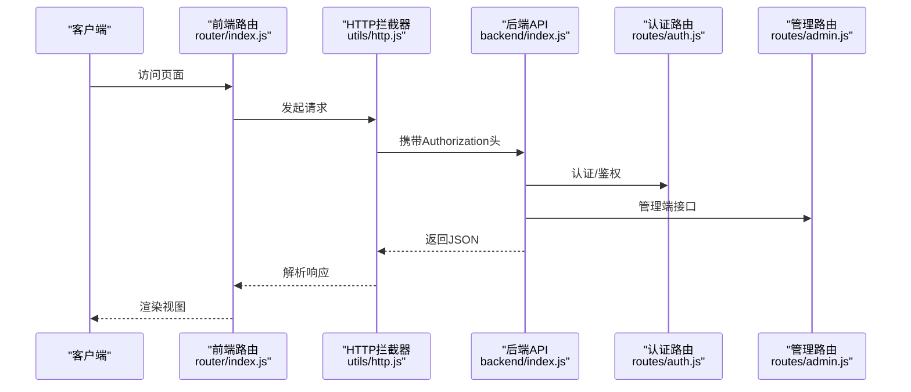

图表来源
- [frontend/h5/src/router/index.js:155-223](file://frontend/h5/src/router/index.js#L155-L223)
- [frontend/h5/src/utils/http.js:19-78](file://frontend/h5/src/utils/http.js#L19-L78)
- [backend/index.js:183-218](file://backend/index.js#L183-L218)
- [backend/routes/auth.js:96-147](file://backend/routes/auth.js#L96-L147)
- [backend/routes/admin.js:29-61](file://backend/routes/admin.js#L29-L61)

## 详细组件分析

### 用户功能模块

#### 1) 服务大厅（全部服务）
- 展示机制：按分组聚合服务卡片，支持搜索过滤，部分服务跳转外部链接或详情页。
- 关键实现：服务分组与图标颜色配置，路由跳转逻辑。
- 使用场景：用户快速浏览与选择服务。

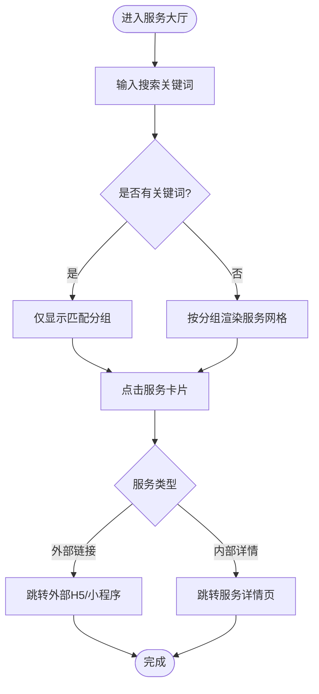

图表来源
- [frontend/h5/src/views/services/Index.vue:64-121](file://frontend/h5/src/views/services/Index.vue#L64-L121)

章节来源
- [frontend/h5/src/views/services/Index.vue:1-225](file://frontend/h5/src/views/services/Index.vue#L1-L225)

#### 2) 全部服务（服务详情与申请）
- 业务逻辑：根据服务ID渲染差异化表单字段，提交后统一走申请接口。
- 关键实现：表单字段按服务类型动态渲染，含日期/时间选择、文件上传、必填校验等。
- 使用场景：用户在线填写需求并提交申请。

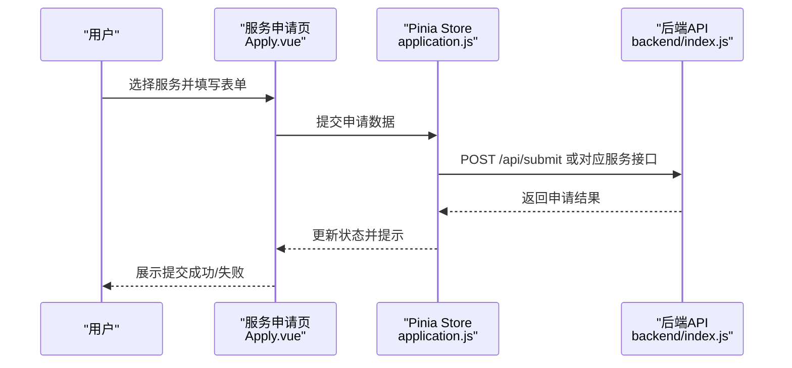

图表来源
- [frontend/h5/src/views/services/Apply.vue:49-688](file://frontend/h5/src/views/services/Apply.vue#L49-L688)
- [frontend/h5/src/stores/application.js:45-127](file://frontend/h5/src/stores/application.js#L45-L127)
- [backend/index.js:434-469](file://backend/index.js#L434-L469)

章节来源
- [frontend/h5/src/views/services/Apply.vue:1-800](file://frontend/h5/src/views/services/Apply.vue#L1-L800)
- [frontend/h5/src/stores/application.js:1-177](file://frontend/h5/src/stores/application.js#L1-L177)

#### 3) 我的申请（状态跟踪）
- 业务逻辑：按当前登录用户拉取其申请列表，展示服务名称、状态、联系方式与申请时间。
- 关键实现：本地存储用户信息与令牌，调用后端列表接口，状态标签样式区分。
- 使用场景：用户查看历史申请与当前进度。

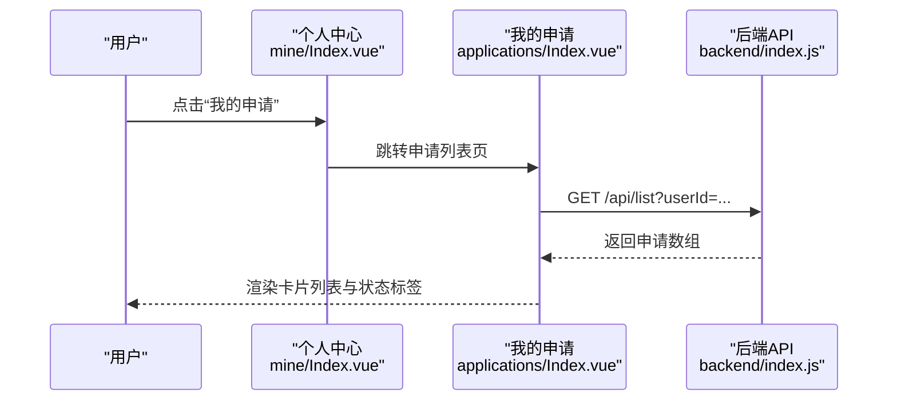

图表来源
- [frontend/h5/src/views/mine/Index.vue:135-213](file://frontend/h5/src/views/mine/Index.vue#L135-L213)
- [frontend/h5/src/views/applications/Index.vue:63-93](file://frontend/h5/src/views/applications/Index.vue#L63-L93)
- [backend/index.js:426-432](file://backend/index.js#L426-L432)

章节来源
- [frontend/h5/src/views/applications/Index.vue:1-176](file://frontend/h5/src/views/applications/Index.vue#L1-L176)
- [frontend/h5/src/views/mine/Index.vue:1-336](file://frontend/h5/src/views/mine/Index.vue#L1-L336)

#### 4) 个人中心（信息管理与安全）
- 业务逻辑：展示用户统计（总申请、处理中、已完成）、快捷入口、退出登录。
- 关键实现：自动刷新令牌、登出清理本地存储、引导客服与帮助信息。
- 使用场景：用户查看个人数据、管理账户与联系客服。

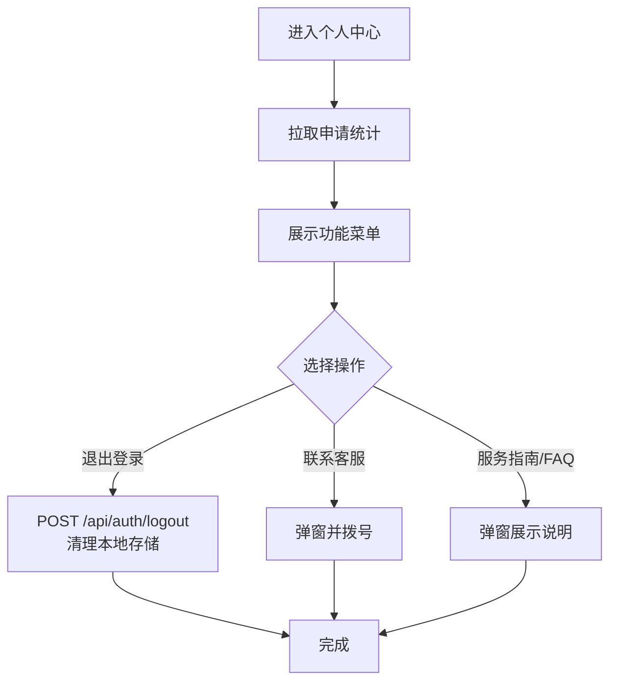

图表来源
- [frontend/h5/src/views/mine/Index.vue:135-250](file://frontend/h5/src/views/mine/Index.vue#L135-L250)
- [frontend/h5/src/utils/http.js:80-95](file://frontend/h5/src/utils/http.js#L80-L95)

章节来源
- [frontend/h5/src/views/mine/Index.vue:1-336](file://frontend/h5/src/views/mine/Index.vue#L1-L336)
- [frontend/h5/src/utils/http.js:1-99](file://frontend/h5/src/utils/http.js#L1-L99)

#### 5) 登录注册（安全流程）
- 业务逻辑：支持账号密码、微信小程序、微信公众号、SSO 多种登录方式；注册校验手机号与密码强度。
- 关键实现：JWT 生成与刷新、速率限制、输入清洗、敏感信息脱敏。
- 使用场景：新用户注册与老用户登录，保障会话安全。

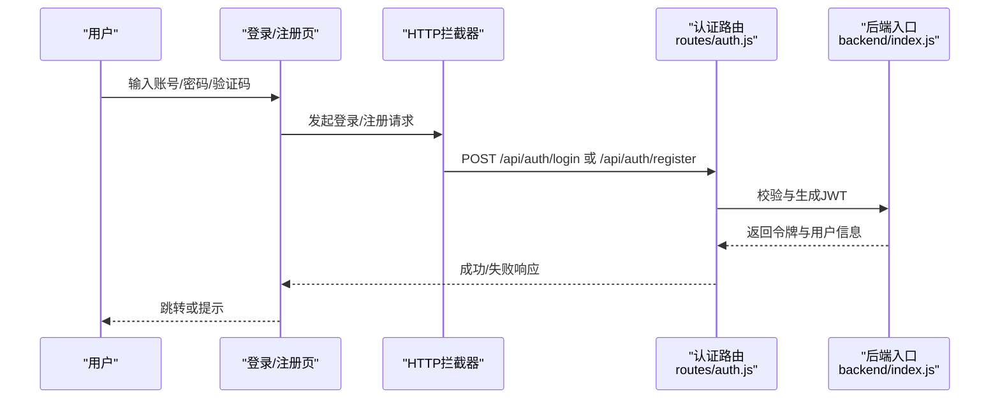

图表来源
- [backend/routes/auth.js:96-205](file://backend/routes/auth.js#L96-L205)
- [backend/index.js:434-469](file://backend/index.js#L434-L469)
- [frontend/h5/src/utils/http.js:19-78](file://frontend/h5/src/utils/http.js#L19-L78)

章节来源
- [backend/routes/auth.js:1-591](file://backend/routes/auth.js#L1-L591)
- [backend/index.js:1-1401](file://backend/index.js#L1-L1401)
- [frontend/h5/src/utils/http.js:1-99](file://frontend/h5/src/utils/http.js#L1-L99)

### 后台管理功能

#### 6) 案例管理（内容发布）
- 业务逻辑：后台可新增/编辑/删除案例，支持图片/视频封面与多资源媒体，支持项目亮点标签。
- 关键实现：上传文件归一化、媒体资源上传、列表分页与筛选。
- 使用场景：运营人员发布服务案例与宣传素材。

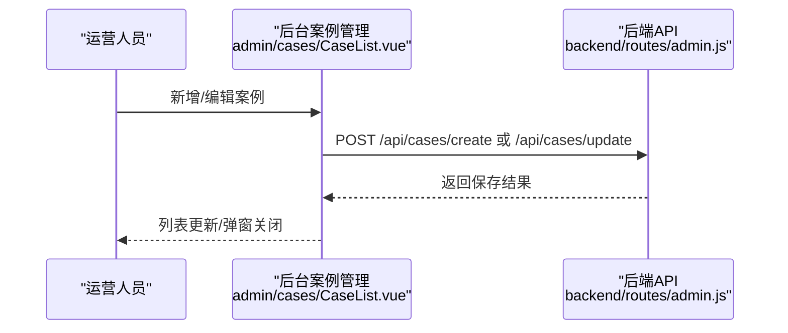

图表来源
- [frontend/h5/src/views/admin/cases/CaseList.vue:187-222](file://frontend/h5/src/views/admin/cases/CaseList.vue#L187-L222)
- [backend/routes/admin.js:171-207](file://backend/routes/admin.js#L171-L207)

章节来源
- [frontend/h5/src/views/admin/cases/CaseList.vue:1-235](file://frontend/h5/src/views/admin/cases/CaseList.vue#L1-L235)
- [backend/routes/admin.js:1-514](file://backend/routes/admin.js#L1-L514)

#### 7) 申请管理（处理流程）
- 业务逻辑：后台按日期范围筛选、批量导出、修改申请状态（待处理/处理中/已完成/已取消）。
- 关键实现：按角色过滤数据（DSL管理员/研学管理员仅可见对应服务），支持批量选择导出。
- 使用场景：客服/运营人员处理用户申请并导出报表。

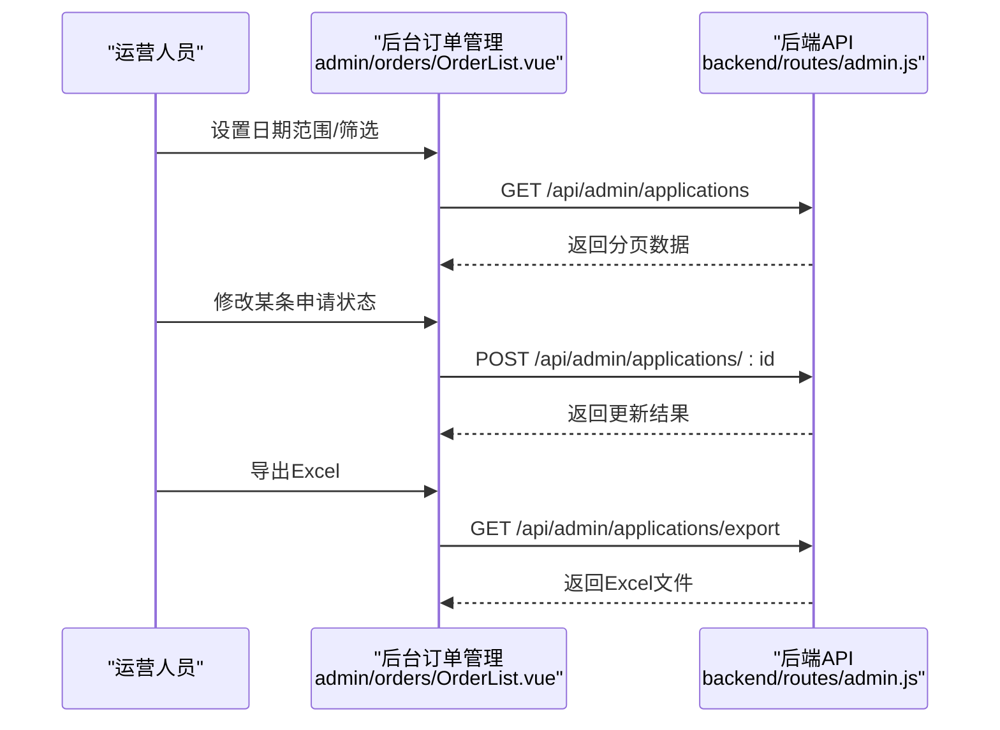

图表来源
- [frontend/h5/src/views/admin/orders/OrderList.vue:191-238](file://frontend/h5/src/views/admin/orders/OrderList.vue#L191-L238)
- [backend/routes/admin.js:66-111](file://backend/routes/admin.js#L66-L111)
- [backend/routes/admin.js:116-166](file://backend/routes/admin.js#L116-L166)
- [backend/routes/admin.js:171-207](file://backend/routes/admin.js#L171-L207)

章节来源
- [frontend/h5/src/views/admin/orders/OrderList.vue:1-258](file://frontend/h5/src/views/admin/orders/OrderList.vue#L1-L258)
- [backend/routes/admin.js:1-514](file://backend/routes/admin.js#L1-L514)

#### 8) 仪表盘（数据概览）
- 业务逻辑：按角色展示总订单、待处理、处理中、已完成、用户数、赛事报名等指标，支持折线图、饼图与柱状图。
- 关键实现：按角色过滤数据源，构建 ECharts 配置。
- 使用场景：管理者快速掌握平台运营状况。

章节来源
- [frontend/h5/src/views/admin/Dashboard.vue:1-301](file://frontend/h5/src/views/admin/Dashboard.vue#L1-L301)
- [backend/routes/admin.js:29-61](file://backend/routes/admin.js#L29-L61)

### 12项核心服务业务逻辑与实现要点

平台内置12项核心服务，前端通过服务ID区分业务类型并在申请页动态渲染相应字段。以下为各服务的关键业务与实现要点：

- 飞行服务（ID: flight）
  - 实现：服务大厅中点击跳转外部飞行申报系统。
  - 使用场景：用户在线进行空域查询与飞行申报。
  - 章节来源
    - [frontend/h5/src/views/services/Index.vue:110-111](file://frontend/h5/src/views/services/Index.vue#L110-L111)

- 无人机物流（ID: 1）
  - 表单字段：客户类型、企业名称、货物类型、重量/体积、起运地/目的地、运输时效、期望时间、附件上传、备注。
  - 使用场景：城市即时配送、物资运输。
  - 章节来源
    - [frontend/h5/src/views/services/Apply.vue:207-366](file://frontend/h5/src/views/services/Apply.vue#L207-L366)

- 政务服务（ID: 2）
  - 表单字段：服务类型、巡检区域、巡检时间、需求说明。
  - 使用场景：环保监测、安全巡查等政府任务。
  - 章节来源
    - [frontend/h5/src/views/services/Apply.vue:369-394](file://frontend/h5/src/views/services/Apply.vue#L369-L394)

- 无人机吊运（ID: 4）
  - 表单字段：吊运物品、物品重量、作业地点、吊运高度。
  - 使用场景：山区/高处设备吊装。
  - 章节来源
    - [frontend/h5/src/views/services/Apply.vue:419-443](file://frontend/h5/src/views/services/Apply.vue#L419-L443)

- 无人机表演（ID: 5）
  - 表单字段：通用需求说明。
  - 使用场景：活动表演、编队飞行。
  - 章节来源
    - [frontend/h5/src/views/services/Apply.vue:668-678](file://frontend/h5/src/views/services/Apply.vue#L668-L678)

- 无人机托管（ID: 3）
  - 表单字段：无人机型号、托管数量、托管时长。
  - 使用场景：专业托管、保养维护。
  - 章节来源
    - [frontend/h5/src/views/services/Apply.vue:397-417](file://frontend/h5/src/views/services/Apply.vue#L397-L417)

- 无人机租赁（ID: 7）
  - 表单字段：通用需求说明。
  - 使用场景：设备/配件租赁。
  - 章节来源
    - [frontend/h5/src/views/services/Apply.vue:668-678](file://frontend/h5/src/views/services/Apply.vue#L668-L678)

- 飞手培训（ID: 6）
  - 表单字段：姓名、电话、性别、出生日期、身份证号、考试机型、证照级别、有无基础。
  - 使用场景：CAAC执照、技能培训。
  - 章节来源
    - [frontend/h5/src/views/services/Apply.vue:446-531](file://frontend/h5/src/views/services/Apply.vue#L446-L531)

- 低空研学（ID: 9）
  - 表单字段：学校/机构、年级/年龄段、参与人数、期望日期、场次、备注。
  - 使用场景：科普教育、实践体验。
  - 章节来源
    - [frontend/h5/src/views/services/Apply.vue:534-601](file://frontend/h5/src/views/services/Apply.vue#L534-L601)

- 二手交易（ID: 10）
  - 表单字段：通用需求说明。
  - 使用场景：设备买卖、以旧换新。
  - 章节来源
    - [frontend/h5/src/views/services/Apply.vue:668-678](file://frontend/h5/src/views/services/Apply.vue#L668-L678)

- 金融服务（ID: 11）
  - 表单字段：通用需求说明。
  - 使用场景：设备保险、飞行护航。
  - 章节来源
    - [frontend/h5/src/views/services/Apply.vue:668-678](file://frontend/h5/src/views/services/Apply.vue#L668-L678)

- 维修服务（ID: 12）
  - 表单字段：服务类型（故障维修/定期保养）、无人机型号、是否在保、购买日期、故障/需求描述、设备照片。
  - 使用场景：故障维修、定期保养。
  - 章节来源
    - [frontend/h5/src/views/services/Apply.vue:604-666](file://frontend/h5/src/views/services/Apply.vue#L604-L666)

- 无人机赛事（ID: 13）
  - 表单字段：注册类型（裁判员/教练员/运动员/俱乐部），按角色展开不同字段（单位名称、姓名、性别、证件号、组别、项目、电话、邮箱、LOGO、负责人、对接人等）。
  - 使用场景：竞技比赛、赛事组织。
  - 章节来源
    - [frontend/h5/src/views/services/Apply.vue:78-204](file://frontend/h5/src/views/services/Apply.vue#L78-L204)

### 服务配置与展示（管理员/DSL管理员/研学管理员）
- 业务逻辑：管理员可查看/更新所有服务配置；DSL管理员仅能更新服务13；研学管理员仅能更新服务9。
- 关键实现：前端 Pinia Store 拉取与提交配置，后端按角色返回/更新。
- 使用场景：运营人员动态调整服务开关与展示内容。

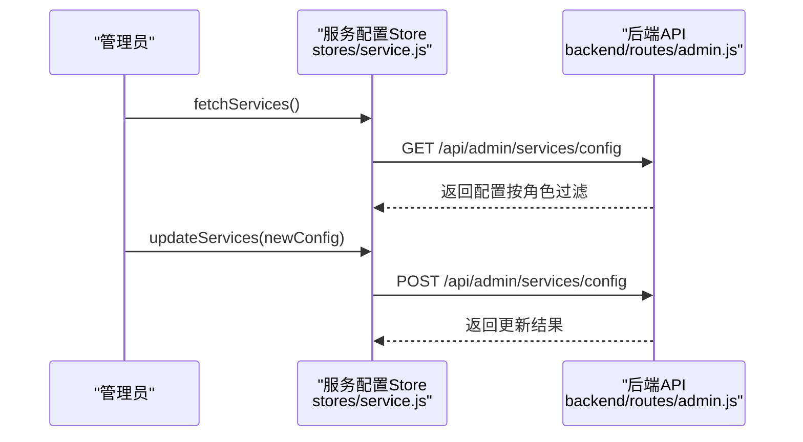

图表来源
- [frontend/h5/src/stores/service.js:38-90](file://frontend/h5/src/stores/service.js#L38-L90)
- [backend/routes/admin.js:282-357](file://backend/routes/admin.js#L282-L357)

章节来源
- [frontend/h5/src/stores/service.js:1-164](file://frontend/h5/src/stores/service.js#L1-L164)
- [backend/routes/admin.js:282-357](file://backend/routes/admin.js#L282-L357)

### 案例展示（用户端）
- 业务逻辑：按分类（全部/物流/吊运/表演）分页加载案例，支持视频/图片轮播、点赞/浏览量展示。
- 关键实现：媒体URL归一化、分页与下拉刷新。
- 使用场景：用户浏览真实服务案例与效果。

章节来源
- [frontend/h5/src/views/cases/Index.vue:1-640](file://frontend/h5/src/views/cases/Index.vue#L1-L640)

## 依赖分析
- 前端依赖
  - Vue 3 + Vant UI：提供组件化与移动端交互。
  - Pinia：集中式状态管理（服务配置、申请列表）。
  - Axios + 自定义拦截器：统一请求/响应处理、自动刷新令牌。
  - 路由守卫：SSO参数透传、管理端权限校验。
- 后端依赖
  - Express：路由与中间件。
  - JWT：认证与授权。
  - Multer：文件上传。
  - XLSX：导出Excel。
  - 输入清洗与错误处理中间件：保障安全与稳定性。

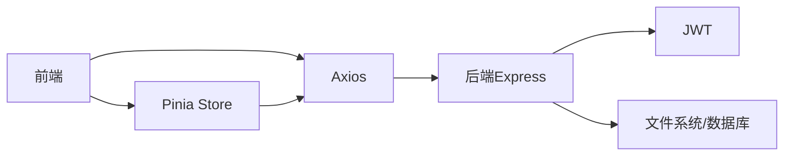

图表来源
- [frontend/h5/src/utils/http.js:1-99](file://frontend/h5/src/utils/http.js#L1-L99)
- [backend/index.js:1-1401](file://backend/index.js#L1-L1401)

章节来源
- [frontend/h5/src/utils/http.js:1-99](file://frontend/h5/src/utils/http.js#L1-L99)
- [backend/index.js:1-1401](file://backend/index.js#L1-L1401)

## 性能考虑
- 前端
  - 图片压缩与懒加载：后端提供图片压缩接口，减少首屏压力。
  - 列表分页与虚拟滚动：后台订单与案例列表采用分页，降低内存占用。
  - 缓存策略：静态资源与图片设置合理缓存头。
- 后端
  - 速率限制：登录/注册接口限制请求频率，防止暴力破解与刷单。
  - 输入清洗：统一消毒输入，降低XSS与注入风险。
  - 并发控制：导出Excel使用缓冲区输出，避免阻塞主线程。

## 故障排查指南
- 登录失败
  - 检查账号/密码是否为空，确认后端认证接口返回。
  - 章节来源
    - [backend/routes/auth.js:96-116](file://backend/routes/auth.js#L96-L116)

- 令牌过期
  - 前端拦截器自动刷新，若失败则清除本地令牌并跳转登录。
  - 章节来源
    - [frontend/h5/src/utils/http.js:28-78](file://frontend/h5/src/utils/http.js#L28-L78)

- 管理端无权限
  - 确认用户角色（admin/dsl_admin/study_admin），按角色过滤数据。
  - 章节来源
    - [backend/routes/admin.js:39-43](file://backend/routes/admin.js#L39-L43)
    - [frontend/h5/src/router/index.js:215-219](file://frontend/h5/src/router/index.js#L215-L219)

- 案例上传失败
  - 检查上传目录权限与文件类型，确认后端上传接口返回。
  - 章节来源
    - [backend/index.js:278-285](file://backend/index.js#L278-L285)
    - [frontend/h5/src/views/admin/cases/CaseList.vue:167-185](file://frontend/h5/src/views/admin/cases/CaseList.vue#L167-L185)

- Excel导出异常
  - 检查导出接口参数与后端XLSX库输出。
  - 章节来源
    - [backend/routes/admin.js:171-207](file://backend/routes/admin.js#L171-L207)

## 结论
本平台围绕“服务+申请+管理”的完整闭环构建，前端通过组件化与状态管理提升开发效率，后端通过JWT与角色控制保障安全与权限隔离。12项核心服务覆盖低空经济主要应用场景，配合案例展示与后台管理能力，形成从用户触达到运营决策的全链路支撑。

## 附录
- 常用接口速览
  - 登录/注册/刷新/登出：/api/auth/*
  - SSO：/api/sso/*
  - 申请列表与导出：/api/list, /api/export
  - 管理端：/api/admin/*
- 前端路由与权限
  - 管理端路由仅admin/dsl_admin/study_admin可访问，SSO参数自动透传。
  - 章节来源
    - [frontend/h5/src/router/index.js:155-223](file://frontend/h5/src/router/index.js#L155-L223)