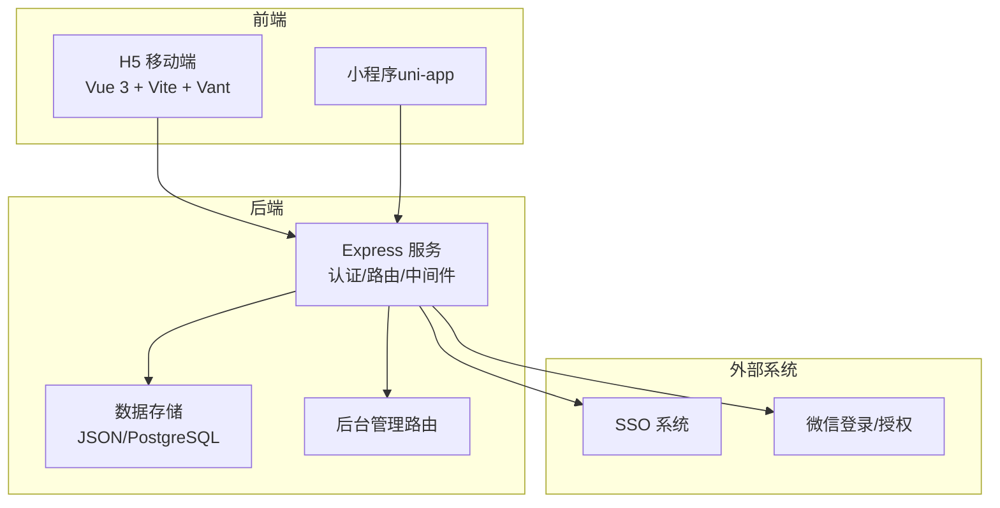
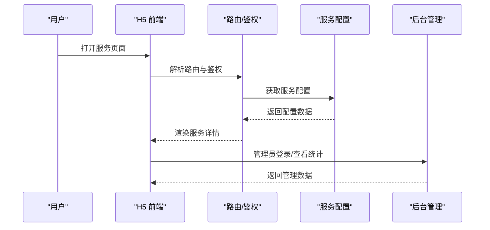
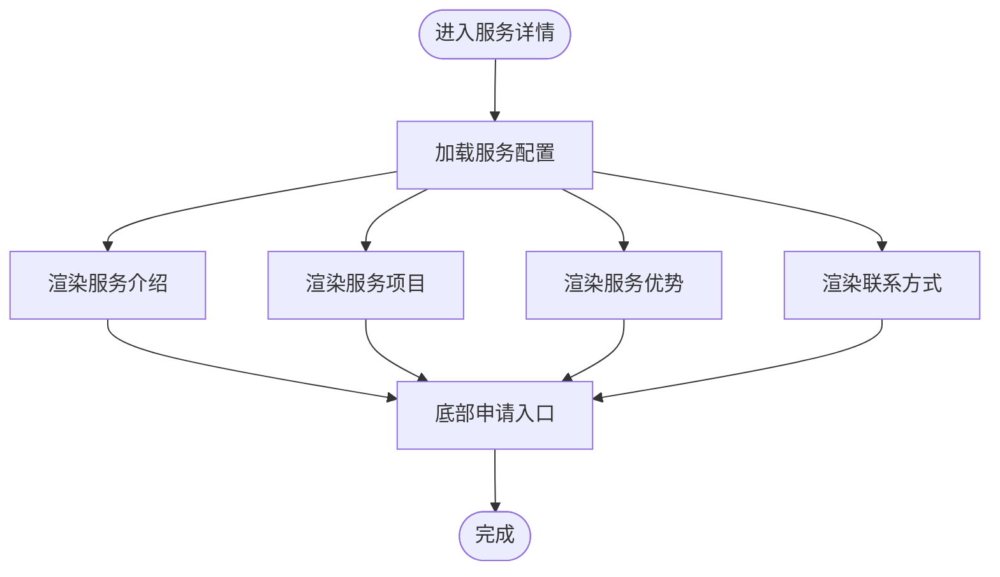
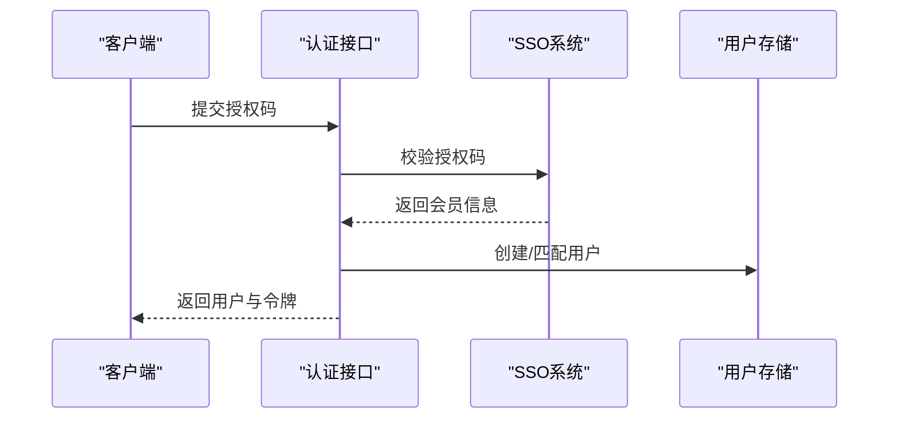
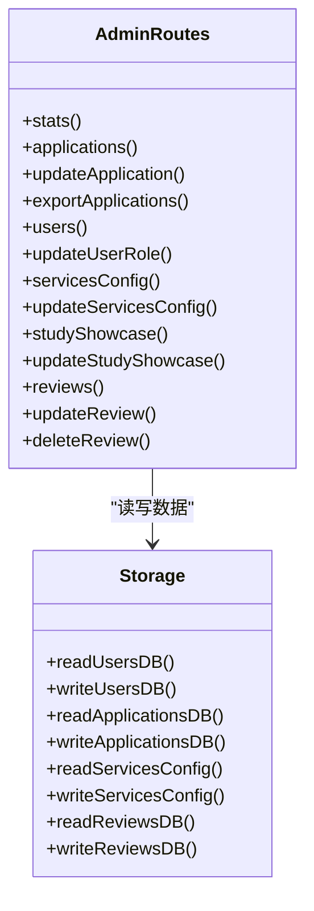
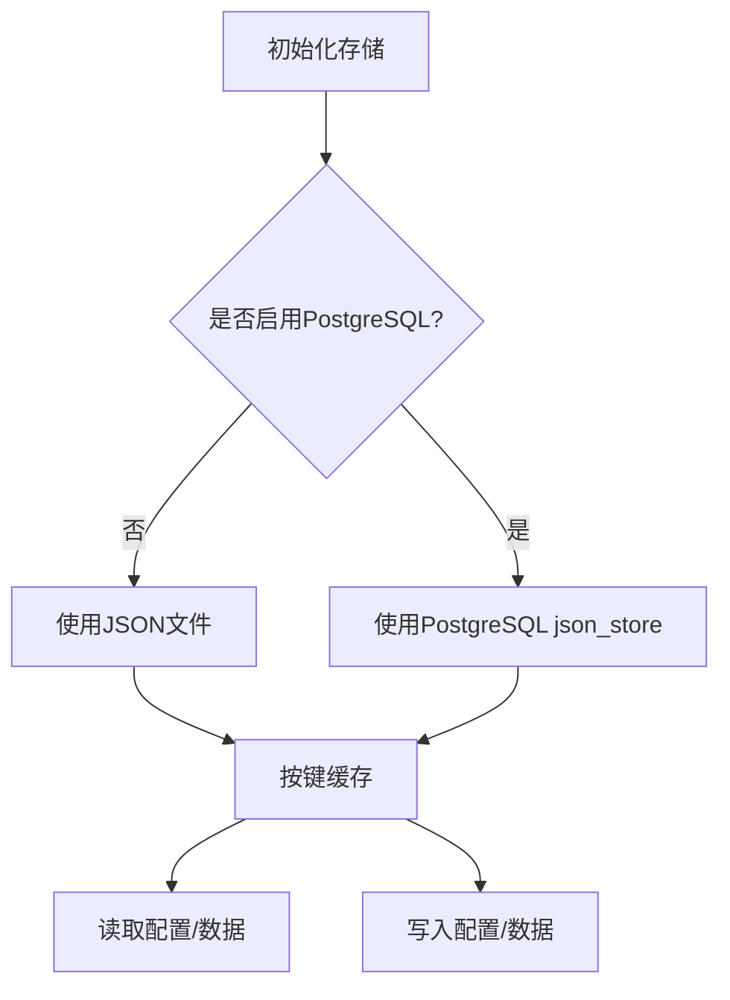
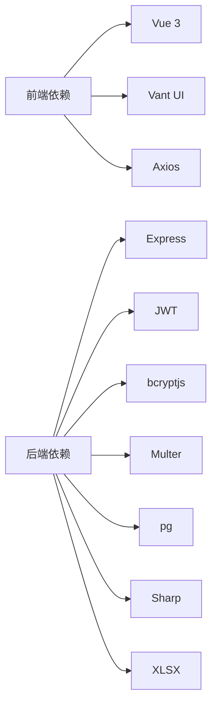

# 项目介绍与目标

<cite>
**本文档引用的文件**
- [backend/index.js](file://backend/index.js)
- [backend/config.js](file://backend/config.js)
- [backend/storage.js](file://backend/storage.js)
- [backend/routes/admin.js](file://backend/routes/admin.js)
- [backend/db/schema.sql](file://backend/db/schema.sql)
- [backend/services_config.json](file://backend/services_config.json)
- [frontend/h5/src/router/index.js](file://frontend/h5/src/router/index.js)
- [frontend/h5/src/views/services/Index.vue](file://frontend/h5/src/views/services/Index.vue)
- [frontend/h5/src/views/services/Detail.vue](file://frontend/h5/src/views/services/Detail.vue)
- [docs/readme.md](file://docs/readme.md)
</cite>

## 目录
1. [引言](#引言)
2. [项目结构](#项目结构)
3. [核心组件](#核心组件)
4. [架构总览](#架构总览)
5. [详细组件分析](#详细组件分析)
6. [依赖分析](#依赖分析)
7. [性能考虑](#性能考虑)
8. [故障排查指南](#故障排查指南)
9. [结论](#结论)
10. [附录](#附录)

## 引言
本项目面向低空经济，致力于构建一个综合性服务对接平台，连接政府、企业与公众，提供覆盖飞行服务、无人机应用、教育培训、研学实践、交易与金融等12项核心服务。平台通过“用户申请—人工对接—服务交付”的模式，解决低空服务在对接效率、管理规范化与用户体验方面的痛点，推动低空产业高质量发展。

平台定位与价值：
- 定位：低空经济的服务枢纽与业务桥梁
- 价值：降低服务供需双方的沟通成本，标准化服务流程，提升服务透明度与可追溯性

## 项目结构
项目采用前后端分离架构，包含：
- 后端（Node.js + Express）：提供认证、存储、管理与SSO集成等能力
- 前端（Vue 3 + Vite + Vant）：H5移动端与小程序（uni-app），提供服务展示、申请与后台管理界面
- 数据存储：支持本地JSON文件与PostgreSQL双模式，兼顾开发与生产部署

**图表来源**
- [backend/index.js:1-120](file://backend/index.js#L1-L120)
- [frontend/h5/src/router/index.js:1-150](file://frontend/h5/src/router/index.js#L1-L150)
- [backend/routes/admin.js:1-60](file://backend/routes/admin.js#L1-L60)

**章节来源**
- [docs/readme.md:84-126](file://docs/readme.md#L84-L126)

## 核心组件
- 认证与会话：JWT令牌签发与刷新、微信登录、SSO授权登录
- 存储与配置：服务配置集中管理、用户/案例/申请/评价数据持久化
- 后台管理：统计、申请审核、用户角色管理、服务配置与展示数据维护
- 前端路由与服务展示：服务网格、详情页、申请入口与后台管理入口

**章节来源**
- [backend/index.js:434-693](file://backend/index.js#L434-L693)
- [backend/storage.js:134-197](file://backend/storage.js#L134-L197)
- [backend/routes/admin.js:29-111](file://backend/routes/admin.js#L29-L111)
- [frontend/h5/src/router/index.js:155-223](file://frontend/h5/src/router/index.js#L155-L223)

## 架构总览
平台整体采用“前端路由 + 后端API + 双存储模式”的架构。前端负责用户交互与导航，后端提供统一的REST接口与管理能力，数据层支持本地JSON与PostgreSQL，满足不同部署阶段的需求。

**图表来源**
- [frontend/h5/src/router/index.js:155-223](file://frontend/h5/src/router/index.js#L155-L223)
- [backend/routes/admin.js:29-61](file://backend/routes/admin.js#L29-L61)
- [backend/services_config.json:1-1230](file://backend/services_config.json#L1-L1230)

## 详细组件分析

### 服务配置与展示组件
- 服务网格：按核心服务、商业应用、教育培训、增值服务、互动反馈五大分组展示12项服务
- 服务详情：根据服务ID加载对应配置，渲染介绍、项目、优势、联系方式等模块
- 研学与培训：提供专属头部、课程包、价格与日程等定制化展示

**图表来源**
- [frontend/h5/src/views/services/Detail.vue:348-418](file://frontend/h5/src/views/services/Detail.vue#L348-L418)
- [frontend/h5/src/views/services/Index.vue:44-121](file://frontend/h5/src/views/services/Index.vue#L44-L121)

**章节来源**
- [frontend/h5/src/views/services/Index.vue:44-121](file://frontend/h5/src/views/services/Index.vue#L44-L121)
- [frontend/h5/src/views/services/Detail.vue:348-418](file://frontend/h5/src/views/services/Detail.vue#L348-L418)
- [backend/services_config.json:1-1230](file://backend/services_config.json#L1-L1230)

### 认证与SSO组件
- 登录/注册：手机号+密码登录、微信登录、SSO授权登录
- 令牌管理：JWT签发与刷新、登录态校验与清理
- SSO对接：从第三方系统获取授权码，换取平台用户并下发令牌

**图表来源**
- [backend/index.js:493-569](file://backend/index.js#L493-L569)
- [backend/index.js:647-693](file://backend/index.js#L647-L693)

**章节来源**
- [backend/index.js:434-693](file://backend/index.js#L434-L693)

### 后台管理组件
- 统计与申请管理：按角色过滤数据、分页查询、状态更新、Excel导出
- 用户与配置管理：角色变更、服务配置按管理员维度隔离更新
- 展示数据维护：研学展示图集与课程包信息的集中管理

**图表来源**
- [backend/routes/admin.js:29-514](file://backend/routes/admin.js#L29-L514)
- [backend/storage.js:134-197](file://backend/storage.js#L134-L197)

**章节来源**
- [backend/routes/admin.js:29-514](file://backend/routes/admin.js#L29-L514)
- [backend/storage.js:134-197](file://backend/storage.js#L134-L197)

### 数据存储与配置组件
- 双存储模式：本地JSON文件与PostgreSQL（json_store表）互为后备，支持平滑迁移
- 缓存策略：用户、案例、申请、服务配置、评价分别设置缓存键与过期时间
- 配置中心：服务配置集中存储，支持按管理员角色隔离访问

**图表来源**
- [backend/storage.js:42-132](file://backend/storage.js#L42-L132)
- [backend/db/schema.sql:1-10](file://backend/db/schema.sql#L1-L10)

**章节来源**
- [backend/storage.js:42-132](file://backend/storage.js#L42-L132)
- [backend/db/schema.sql:1-10](file://backend/db/schema.sql#L1-L10)

## 依赖分析
- 前端依赖：Vue 3、Vite、Vant、Axios、Pinia、Vue Router
- 后端依赖：Express、JWT、bcryptjs、Multer、PostgreSQL驱动、Sharp图像处理、XLSX导出
- 配置与安全：dotenv、Winston日志、SM2加密组件

**图表来源**
- [frontend/h5/package.json:10-26](file://frontend/h5/package.json#L10-L26)
- [backend/package.json:12-33](file://backend/package.json#L12-L33)

**章节来源**
- [frontend/h5/package.json:10-26](file://frontend/h5/package.json#L10-L26)
- [backend/package.json:12-33](file://backend/package.json#L12-L33)

## 性能考虑
- 前端性能
  - 图标与图片采用懒加载与压缩策略，减少首屏压力
  - 使用Vant组件库与轻量路由，保证移动端流畅度
- 后端性能
  - 存储层引入缓存键与过期策略，降低重复读取成本
  - 图像压缩接口采用流式处理，失败回退原图，兼顾可用性与性能
- 数据库扩展
  - PostgreSQL模式下，可通过索引与查询优化进一步提升大数据量场景下的响应速度

[本节为通用性能建议，无需特定文件引用]

## 故障排查指南
- 登录与鉴权
  - 若出现“未登录或登录已过期”，检查请求头Authorization与令牌有效期
  - 微信登录失败时，确认小程序AppID/Secret与授权回调配置
- SSO对接
  - 授权码无效或过期时，重新发起授权流程并检查回调参数
- 数据访问
  - 服务配置为空或异常，检查服务配置文件与数据库json_store表
  - 后台导出Excel失败，确认申请数据与导出字段映射
- 日志与监控
  - 后端使用Winston记录请求日志与错误，结合日志定位问题

**章节来源**
- [backend/index.js:183-218](file://backend/index.js#L183-L218)
- [backend/index.js:695-762](file://backend/index.js#L695-L762)
- [backend/routes/admin.js:171-207](file://backend/routes/admin.js#L171-L207)

## 结论
本项目以“服务配置中心 + 前后端协同 + 双存储模式”为核心，围绕12项低空服务构建了完整的业务闭环。通过标准化的申请流程、精细化的后台管理与可扩展的数据层，平台有效提升了服务对接效率、规范了管理流程并改善了用户体验，为低空经济的规模化发展提供了坚实支撑。

[本节为总结性内容，无需特定文件引用]

## 附录

### 12项核心服务与业务价值
- 飞行服务：简化飞行计划申报与预约，提高空域使用效率
- 无人机外卖：解决园区/景区即时配送痛点，提升服务可达性
- 无人机物流：实现医疗/急件等物资的快速点对点运输
- 政务巡检：提供环保监测、安全巡查等智能化解决方案
- 无人机托管：提供设备存储、保养与代飞的一站式服务
- 无人机吊运：突破地形限制，实现复杂场景的高效吊装
- 无人机表演：为庆典/宣传提供创意编队与视觉体验
- 飞手培训：提供CAAC/AOPA认证培训，支撑行业人才建设
- 无人机租赁：灵活多样的机型与租期，满足多样化使用需求
- 低空研学：面向青少年的科普与实践课程，培育未来人才
- 二手交易：提供设备评估与交易担保，促进资源循环利用
- 金融服务：覆盖设备保险与融资租赁，降低使用成本与风险

**章节来源**
- [docs/readme.md:55-70](file://docs/readme.md#L55-L70)
- [backend/services_config.json:1-1230](file://backend/services_config.json#L1-L1230)