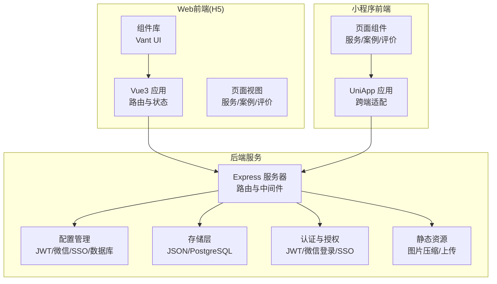
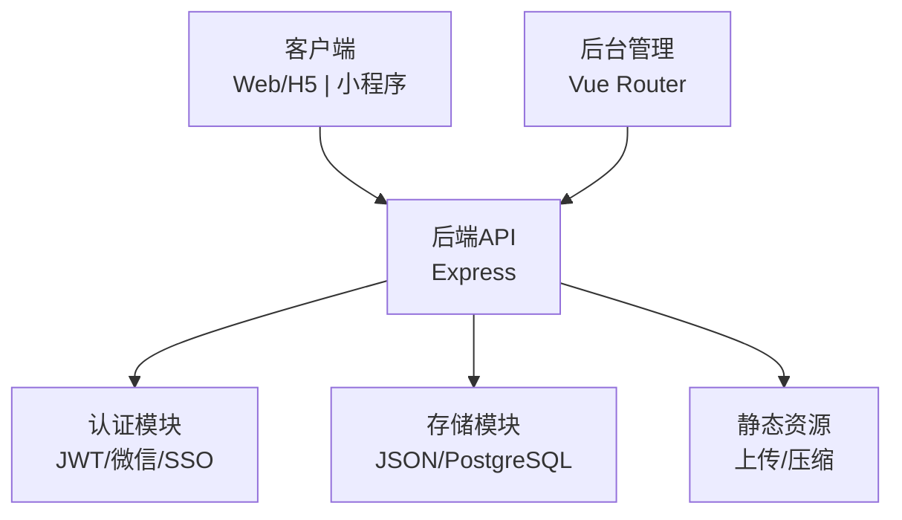
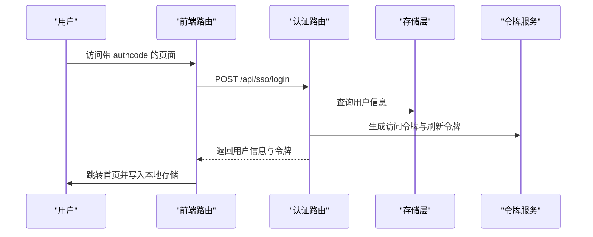
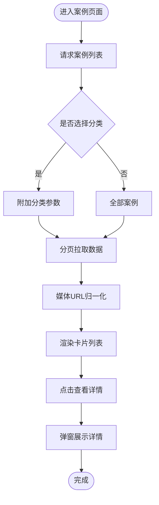
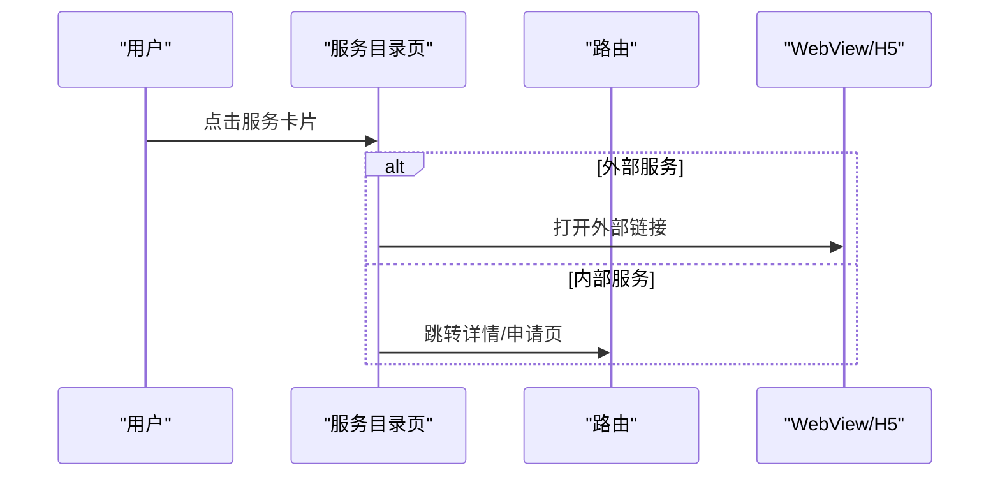
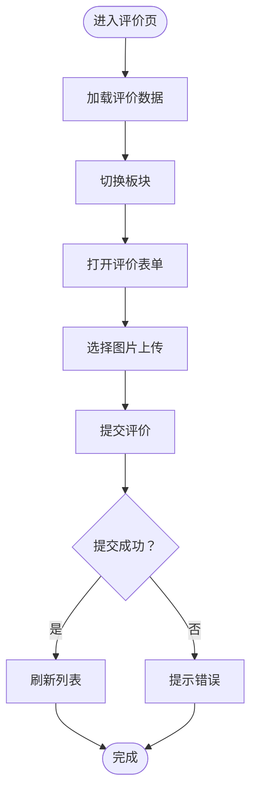
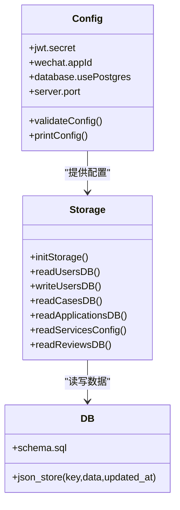
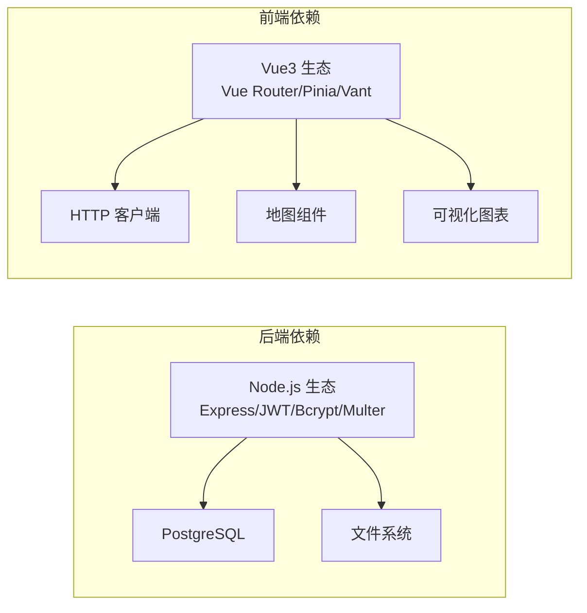

# 项目概述

<cite>
**本文档引用的文件**
- [backend/package.json](file://backend/package.json)
- [frontend/h5/package.json](file://frontend/h5/package.json)
- [backend/index.js](file://backend/index.js)
- [backend/config.js](file://backend/config.js)
- [backend/routes/admin.js](file://backend/routes/admin.js)
- [backend/routes/auth.js](file://backend/routes/auth.js)
- [backend/storage.js](file://backend/storage.js)
- [backend/db/schema.sql](file://backend/db/schema.sql)
- [frontend/h5/src/main.js](file://frontend/h5/src/main.js)
- [frontend/h5/src/router/index.js](file://frontend/h5/src/router/index.js)
- [frontend/h5/src/views/services/Index.vue](file://frontend/h5/src/views/services/Index.vue)
- [frontend/h5/src/views/cases/Index.vue](file://frontend/h5/src/views/cases/Index.vue)
- [frontend/h5/src/views/reviews/Index.vue](file://frontend/h5/src/views/reviews/Index.vue)
- [frontend/miniprogram/main.js](file://frontend/miniprogram/main.js)
- [frontend/miniprogram/pages/services/index.vue](file://frontend/miniprogram/pages/services/index.vue)
</cite>

## 目录
1. [引言](#引言)
2. [项目结构](#项目结构)
3. [核心组件](#核心组件)
4. [架构总览](#架构总览)
5. [详细组件分析](#详细组件分析)
6. [依赖关系分析](#依赖关系分析)
7. [性能考虑](#性能考虑)
8. [故障排除指南](#故障排除指南)
9. [结论](#结论)
10. [附录](#附录)

## 引言

低空飞行服务平台是一个面向低空经济生态的一站式服务管理平台，致力于为无人机相关服务提供完整的线上申请、管理、展示与评价闭环。平台通过统一的后端服务支撑Web端、移动端与小程序三端应用，覆盖飞行服务、物流配送、吊运作业、表演编队、培训教育、赛事组织、销售交易、研学实践等多个业务场景。

项目的核心目标包括：
- 构建统一的服务入口与申请流程，简化用户操作路径
- 提供案例展示与评价体系，增强服务透明度与口碑建设
- 支撑多角色权限与后台管理，保障运营效率与数据治理
- 实现多端协同与SSO集成，提升用户体验与接入便利性

业务价值体现在：
- 降低低空服务供需双方的信息不对称，提高服务匹配效率
- 通过案例与评价形成示范效应，推动行业规范化发展
- 为政府监管与行业统计提供数据基础，助力低空经济发展

## 项目结构

项目采用前后端分离架构，分为后端服务、Web前端、小程序前端三个子工程，配合共享的数据库与静态资源目录。

图表来源
- [backend/index.js:1-120](file://backend/index.js#L1-L120)
- [backend/config.js:1-123](file://backend/config.js#L1-L123)
- [backend/storage.js:1-197](file://backend/storage.js#L1-L197)
- [frontend/h5/src/main.js:1-22](file://frontend/h5/src/main.js#L1-L22)
- [frontend/miniprogram/main.js:1-22](file://frontend/miniprogram/main.js#L1-L22)

章节来源
- [backend/package.json:1-34](file://backend/package.json#L1-L34)
- [frontend/h5/package.json:1-27](file://frontend/h5/package.json#L1-L27)

## 核心组件

- 后端服务（Node.js + Express）
  - 提供REST API与静态资源服务，支持JWT认证、微信登录、SSO对接、文件上传与图片压缩
  - 内置配置管理模块，集中管理JWT密钥、微信凭证、数据库连接与服务器参数
  - 存储层支持本地JSON文件与PostgreSQL双模式，具备缓存与迁移能力

- Web前端（Vue3 + Vant）
  - 采用Vue Router进行页面路由管理，支持SSO参数自动登录
  - 提供服务目录、案例展示、评价系统、后台管理等核心页面
  - 集成图片压缩与媒体资源归一化处理，优化移动端体验

- 小程序前端（UniApp）
  - 基于Vue生态的跨端实现，适配微信小程序与H5
  - 页面结构与交互逻辑与Web端保持一致，便于统一维护

章节来源
- [backend/index.js:1-200](file://backend/index.js#L1-L200)
- [backend/config.js:1-123](file://backend/config.js#L1-L123)
- [backend/storage.js:1-197](file://backend/storage.js#L1-L197)
- [frontend/h5/src/main.js:1-22](file://frontend/h5/src/main.js#L1-L22)
- [frontend/miniprogram/main.js:1-22](file://frontend/miniprogram/main.js#L1-L22)

## 架构总览

平台采用“后端API + 多端前端”的分层架构，后端负责业务逻辑与数据持久化，前端通过HTTP协议与后端交互，实现统一的数据与状态管理。

图表来源
- [backend/index.js:1-120](file://backend/index.js#L1-L120)
- [backend/routes/auth.js:1-120](file://backend/routes/auth.js#L1-L120)
- [backend/storage.js:1-120](file://backend/storage.js#L1-L120)

## 详细组件分析

### 认证与授权模块

该模块负责用户登录、令牌签发与刷新、微信登录、SSO对接以及权限校验。

图表来源
- [frontend/h5/src/router/index.js:155-182](file://frontend/h5/src/router/index.js#L155-L182)
- [backend/routes/auth.js:320-392](file://backend/routes/auth.js#L320-L392)
- [backend/index.js:492-549](file://backend/index.js#L492-L549)

章节来源
- [backend/routes/auth.js:1-591](file://backend/routes/auth.js#L1-L591)
- [backend/index.js:434-693](file://backend/index.js#L434-L693)

### 案例展示模块

案例模块提供案例分类浏览、分页加载、媒体轮播与详情弹窗，支持图片与视频混合展示。

图表来源
- [frontend/h5/src/views/cases/Index.vue:269-344](file://frontend/h5/src/views/cases/Index.vue#L269-L344)
- [backend/index.js:367-423](file://backend/index.js#L367-L423)

章节来源
- [frontend/h5/src/views/cases/Index.vue:1-640](file://frontend/h5/src/views/cases/Index.vue#L1-L640)

### 服务目录与申请模块

服务目录页面提供服务分组与搜索，支持跳转到服务详情与申请页面，部分外部服务通过WebView打开。

图表来源
- [frontend/h5/src/views/services/Index.vue:109-121](file://frontend/h5/src/views/services/Index.vue#L109-L121)
- [frontend/miniprogram/pages/services/index.vue:74-90](file://frontend/miniprogram/pages/services/index.vue#L74-L90)

章节来源
- [frontend/h5/src/views/services/Index.vue:1-225](file://frontend/h5/src/views/services/Index.vue#L1-L225)
- [frontend/miniprogram/pages/services/index.vue:1-208](file://frontend/miniprogram/pages/services/index.vue#L1-L208)

### 评价系统模块

评价系统支持按板块查看、匿名与实名评价、图片上传与课程关联，前端提供评分与富文本输入。

图表来源
- [frontend/h5/src/views/reviews/Index.vue:263-397](file://frontend/h5/src/views/reviews/Index.vue#L263-L397)
- [backend/routes/auth.js:152-205](file://backend/routes/auth.js#L152-L205)

章节来源
- [frontend/h5/src/views/reviews/Index.vue:1-638](file://frontend/h5/src/views/reviews/Index.vue#L1-L638)

### 存储与配置模块

存储模块支持本地JSON文件与PostgreSQL两种模式，具备缓存与初始化能力；配置模块集中管理JWT、微信、SSO、数据库等参数。

图表来源
- [backend/config.js:1-123](file://backend/config.js#L1-L123)
- [backend/storage.js:1-197](file://backend/storage.js#L1-L197)
- [backend/db/schema.sql:1-10](file://backend/db/schema.sql#L1-L10)

章节来源
- [backend/config.js:1-123](file://backend/config.js#L1-L123)
- [backend/storage.js:1-197](file://backend/storage.js#L1-L197)
- [backend/db/schema.sql:1-10](file://backend/db/schema.sql#L1-L10)

## 依赖关系分析

后端与前端的关键依赖关系如下：

图表来源
- [backend/package.json:12-28](file://backend/package.json#L12-L28)
- [frontend/h5/package.json:10-19](file://frontend/h5/package.json#L10-L19)

章节来源
- [backend/package.json:1-34](file://backend/package.json#L1-L34)
- [frontend/h5/package.json:1-27](file://frontend/h5/package.json#L1-L27)

## 性能考虑

- 缓存策略
  - 用户、案例、申请、服务配置、评价等数据均设置不同缓存过期时间，减少数据库压力
- 图片处理
  - 提供图片压缩接口，支持按宽度与质量参数动态调整，兼顾清晰度与传输效率
- 分页与懒加载
  - 案例与评价列表采用分页与下拉刷新，避免一次性加载大量数据
- 存储模式
  - 支持PostgreSQL与JSON文件双模式，生产环境建议使用PostgreSQL以获得更好的扩展性

## 故障排除指南

常见问题与排查要点：
- 登录失败
  - 检查JWT密钥配置与令牌有效期；确认用户密码是否已升级为哈希存储
- 微信登录异常
  - 核对微信小程序与公众号AppID/Secret配置；确认回调地址与域名白名单
- SSO授权失败
  - 确认authcode参数传递与后端SSO接口可用性；检查用户信息映射逻辑
- 文件上传失败
  - 检查上传目录权限与文件大小限制；确认前端FormData构造与后端Multer配置
- 数据库连接问题
  - 确认PostgreSQL连接参数与SSL配置；如使用JSON模式，检查数据文件权限

章节来源
- [backend/routes/auth.js:96-147](file://backend/routes/auth.js#L96-L147)
- [backend/index.js:695-762](file://backend/index.js#L695-L762)
- [backend/config.js:78-104](file://backend/config.js#L78-L104)
- [backend/storage.js:42-63](file://backend/storage.js#L42-L63)

## 结论

低空飞行服务平台通过统一的后端API与多端前端，构建了覆盖服务申请、案例展示、评价系统的完整业务闭环。项目采用模块化的架构设计与清晰的配置管理，既满足当前业务需求，又为未来扩展（如数据库规范化、权限细化、监控告警）预留空间。建议在生产环境中优先启用PostgreSQL与严格的密钥管理，并持续优化缓存与图片处理策略以提升用户体验。

## 附录

- 快速开始
  - 后端启动：安装依赖后执行启动脚本，确保配置文件与数据库准备就绪
  - 前端启动：分别在H5与小程序目录执行开发命令，访问对应端口或使用小程序开发者工具
  - 环境变量：根据部署环境设置JWT密钥、微信凭证、数据库连接等参数

章节来源
- [backend/package.json:6-11](file://backend/package.json#L6-L11)
- [frontend/h5/package.json:5-9](file://frontend/h5/package.json#L5-L9)